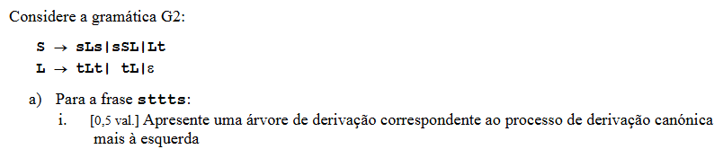

# Qual é o simbolo inciial, baseado com a informacao que nos foi dada

Sim, poderia. O que eu disse antes — “começamos sempre em S” — era verdade **para esta gramática concreta**, porque nela o símbolo inicial é `S`.

Numa gramática, há sempre um símbolo inicial escolhido. O PDF define:

```text
G = (V, Σ, P, S)
```

e diz que o último elemento, `S`, é o **símbolo inicial a partir do qual todas as frases são derivadas**. 

Mas atenção: a letra usada para o símbolo inicial **não tem obrigatoriamente de ser S**.

Por exemplo, poderíamos ter:

```text
G = ({S,L}, {s,t}, P, L)
```

Aqui o último elemento é `L`.

Então o símbolo inicial seria:

```text
L
```

e todas as derivações começariam em `L`.

Por exemplo:

```text
L
=> tL
=> ttL
=> tt
```

Portanto, o que determina onde começamos **não é o nome da letra**. É o que estiver definido como símbolo inicial na gramática.

No teu exercício, embora só tenham mostrado as regras:

```text
S -> sLs | ssL | Lt
L -> tLt | tL | ε
```

é evidente pelo contexto que `S` está a ser usado como símbolo inicial. Por isso, para gerar `sttts`, começamos em:

```text
S
```

e não em `L`.

A regra que deves guardar é:

> **Começamos sempre no símbolo inicial da gramática. Esse símbolo costuma chamar-se `S`, mas poderia chamar-se `L`, `A`, `X`, etc.**


## Mas não aparece a formula de G2

Tens razão: **só com esse excerto não dá para provar formalmente que `S` é o símbolo inicial**.

Eu antes disse que era “evidente pelo contexto”, mas isso foi demasiado forte. O que podemos dizer é que **é muito provável que `S` seja o símbolo inicial**, porque é a convenção habitual e aparece como o primeiro não terminal apresentado:

```text
S -> sLs | ssL | Lt
L -> tLt | tL | ε
```

Mas isso é uma **inferência**, não uma prova.

Para sabermos formalmente, o enunciado teria de dar algo como:

```text
G2 = ({S,L}, {s,t}, P, S)
```

Nesse caso, o último `S` é que nos diz que o símbolo inicial é `S`.

Ou então teria de dizer explicitamente:

```text
Símbolo inicial: S
```

Se, pelo contrário, estivesse definido:

```text
G2 = ({S,L}, {s,t}, P, L)
```

então o símbolo inicial seria `L`, apesar de existir uma regra para `S`.

Portanto, para este exercício:

> **A imagem que mostraste, isoladamente, não contém informação suficiente para demonstrar que `S` é o símbolo inicial.**

É razoável assumir que seja `S` pela convenção usada, mas se isto fizer parte de uma página maior do exame, pode haver informação imediatamente antes que o confirme. Se me mostrares a parte anterior do enunciado, digo-te com certeza.


# Resolucao do exercicio


Sim. Aqui estão a pedir-te **duas coisas ao mesmo tempo**, mas vamos separar.

A gramática continua a ser:

```text
S -> sLs | ssL | Lt
L -> tLt | tL | ε
```

E agora dizem:

```text
Para a frase sttts
```

Ou seja, querem mostrar **como a gramática consegue gerar exatamente**:

```text
s t t t s
```

## 1. O que é uma derivação?

Uma **derivação** é simplesmente começar no símbolo inicial `S` e ir aplicando as regras da gramática até ficar apenas com terminais.

Começamos sempre em:

```text
S
```

Queremos chegar a:

```text
sttts
```

Olha para a palavra:

```text
s t t t s
↑       ↑
s       s
```

Começa por `s` e termina por `s`.

Na gramática existe precisamente:

```text
S -> sLs
```

Por isso escolhemos essa regra:

```text
S
=> sLs
```

Agora já temos:

```text
s  L  s
```

E precisamos que o `L` produza:

```text
ttt
```

para ficarmos com:

```text
s + ttt + s
=
sttts
```

---

## 2. Como fazemos `L` produzir `ttt`?

Temos a regra:

```text
L -> tL
```

Ela significa:

> produzir um `t` e continuar com outro `L`.

Então:

```text
L
=> tL
=> ttL
=> tttL
```

Agora já temos os três `t`.

Só precisamos de fazer o `L` desaparecer.

Para isso existe:

```text
L -> ε
```

Logo:

```text
tttL
=> ttt
```

---

# 3. Derivação completa

Juntando tudo:

```text
S
=> sLs
=> stLs
=> sttLs
=> stttLs
=> sttts
```

Vamos ver exatamente que regra foi utilizada em cada passo:

```text
S
=> sLs          usando S -> sLs

=> stLs         usando L -> tL

=> sttLs        usando L -> tL

=> stttLs       usando L -> tL

=> sttts        usando L -> ε
```

E chegámos à frase pedida:

```text
sttts
```

---

# Mas será que essa foi a derivação canónica mais à esquerda?

**Você fez**

```text
S
=> sLs
=> stLs
=> sttLs
=> stttLs
=> sttts
```

**mas não usou a produção de L mais à esquerda que podia ter sido utilizada L -> tLt ficando** 

```text
S 
=> sLs 
=> stLts 
=> sttLts 
=> sttts
```

**ERRADO, A PRIMEIRA SOLUÇÃO TAMBÉM É UMA DERIVAÇÃO MAIS À esquerda**

Explicação:


Sim — a tua derivação também está correta e também é uma derivação mais à esquerda.

O ponto essencial é este:

> “Derivação mais à esquerda” não quer dizer “escolher a regra que tem o L mais à esquerda” nem “usar a produção que aparece primeiro”.
> Quer dizer: em cada passo, se houver vários não terminais na frase intermédia, tens de expandir o não terminal que está mais à esquerda.

O PDF usa precisamente “derivação mais à esquerda” nesse sentido. 


## Exemplo básico

Claro. Usa esta gramática muito simples:

```text
S -> AB
A -> aA | a
B -> bB | b
```

Queremos gerar a palavra:

```text
aabb
```

Uma **derivação mais à esquerda** significa: sempre que houver mais do que um não terminal na expressão atual, expandimos primeiro o que estiver mais à esquerda.

Começamos:

```text
S
```

Aplicamos:

```text
S -> AB
```

Fica:

```text
AB
```

Agora há dois não terminais:

```text
A   B
↑
mais à esquerda
```

Portanto temos de mexer primeiro no `A`, não no `B`.

Fazemos:

```text
AB
=> aAB
```

usando:

```text
A -> aA
```

Agora temos:

```text
aAB
```

Ainda há dois não terminais:

```text
a A B
  ↑
  mais à esquerda
```

Voltamos a expandir `A`:

```text
aAB
=> aaB
```

usando:

```text
A -> a
```

Agora só temos `B`:

```text
aaB
```

Então:

```text
aaB
=> aabB
```

usando:

```text
B -> bB
```

e finalmente:

```text
aabB
=> aabb
```

usando:

```text
B -> b
```

Portanto a derivação mais à esquerda completa é:

```text
S
=> AB
=> aAB
=> aaB
=> aabB
=> aabb
```

O ponto essencial é este:

```text
AB
```

não podíamos começar por expandir `B`, porque `A` é o não terminal mais à esquerda.

Se fizéssemos:

```text
AB
=> AbB
```

isso já não seria uma derivação mais à esquerda; seria uma derivação em que começámos pelo não terminal da direita.


## Voltando ao nosso caso


No nosso caso, depois de:

```text
S => sLs
```

há apenas um não terminal:

```text
L
```

Portanto podes aplicar qualquer produção válida de L:

```text
L -> tLt
L -> tL
L -> ε
```

desde que consigas chegar à palavra pretendida.

A tua derivação:

```text
S
=> sLs
=> stLts
=> sttLts
=> sttts
```

está correta.

As regras usadas são:

```text
S => sLs
   usando S -> sLs

sLs => stLts
   usando L -> tLt

stLts => sttLts
   usando L -> tL

sttLts => sttts
   usando L -> ε
```

Verifiquemos o último passo com cuidado:

```text
sttLts
```

substituímos L por ε:

```text
stt ε ts
```

fica:

```text
sttts
```

Portanto está certíssimo.

A minha derivação anterior também era válida:

```text
S
=> sLs
=> stLs
=> sttLs
=> stttLs
=> sttts
```

porque em todos os passos havia apenas um não terminal L e foi sempre esse que foi expandido.

Ou seja, há pelo menos estas duas derivações mais à esquerda para a mesma palavra:

```text
1)
S
=> sLs
=> stLs
=> sttLs
=> stttLs
=> sttts
```

e

```text
2)
S
=> sLs
=> stLts
=> sttLts
=> sttts
```

Isto é importante porque as duas derivacões não usam as mesmas produções. Logo podem originar árvores de derivação diferentes.

E o PDF diz que uma gramática é ambígua quando a mesma frase pode ser obtida através de duas árvores de derivação distintas. 

Portanto, a tua observação é muito boa: **“mais à esquerda” não obriga a escolher `L -> tL`; `L -> tLt` também pode ser escolhido.** O requisito é apenas expandir o não terminal mais à esquerda disponível.


# 4. O que significa "derivação canónica mais à esquerda"?

É aqui que o nome parece mais complicado do que aquilo que é.

**Mais à esquerda** significa:

> Se houver vários não terminais na expressão, tens de substituir sempre o não terminal que estiver mais à esquerda.

Lembra-te:

```text
S, L
```

são não terminais.

Enquanto:

```text
s, t
```

são terminais.

No nosso exemplo:

```text
sLs
```

só existe um não terminal:

```text
L
```

Por isso nem temos escolha.

Depois:

```text
stLs
```

continua a existir apenas um `L`.

Depois:

```text
sttLs
```

continua a existir apenas um.

Portanto esta derivação é automaticamente uma derivação mais à esquerda.

---

# 5. E o que é a árvore de derivação?

É **a mesma derivação, mas desenhada como uma árvore**.

Começámos por:

```text
S -> sLs
```

Então o topo é `S`, que tem três filhos:

```text
        S
      / | \
     s  L  s
```

Agora esse `L` fez:

```text
L -> tL
```

Então:

```text
        S
      / | \
     s  L  s
       / \
      t   L
```

Esse novo `L` também faz:

```text
L -> tL
```

Fica:

```text
        S
      / | \
     s  L  s
       / \
      t   L
         / \
        t   L
```

Outra vez:

```text
L -> tL
```

Fica:

```text
        S
      / | \
     s  L  s
       / \
      t   L
         / \
        t   L
           / \
          t   L
```

Finalmente:

```text
L -> ε
```

Então a árvore completa é:

```text
        S
      / | \
     s  L  s
       / \
      t   L
         / \
        t   L
           / \
          t   L
              |
              ε
```

Agora lê **as folhas da árvore da esquerda para a direita**:

```text
s   t   t   t   ε   s
```

Como `ε` significa vazio, desaparece:

```text
s t t t s
```

Resultado:

```text
sttts
```

✅

### Portanto, a resposta que colocarias no exercício é:

**Derivação canónica mais à esquerda:**

```text
S => sLs => stLs => sttLs => stttLs => sttts
```

**Árvore:**

```text
        S
      / | \
     s  L  s
       / \
      t   L
         / \
        t   L
           / \
          t   L
              |
              ε
```

A parte mais importante para perceberes é: **a árvore não é uma coisa diferente da derivação**. É simplesmente o desenho das regras que aplicaste para passar de `S` até `sttts`.


