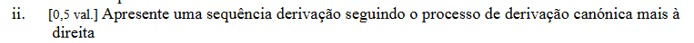

Agora pede-te a **derivação canónica mais à direita** da mesma frase:

```text
sttts
```

com a gramática:

```text
S -> sLs | ssL | Lt
L -> tLt | tL | ε
```

A diferença é muito simples:

* **mais à esquerda** = se existirem vários não terminais, substituis sempre o que estiver mais à esquerda;
* **mais à direita** = se existirem vários não terminais, substituis sempre o que estiver mais à direita.

No teu exercício acontece uma coisa curiosa: **em cada passo só existe um não terminal `L`**. Portanto, ele é simultaneamente o não terminal mais à esquerda **e** o mais à direita.

Para gerar `sttts`, podemos fazer:

```text
S
=> sLs
=> stLts
=> sttLts
=> sttts
```

As regras utilizadas foram:

```text
S => sLs
   usando S -> sLs

sLs => stLts
   usando L -> tLt

stLts => sttLts
   usando L -> tL

sttLts => sttts
   usando L -> ε
```

Repara:

```text
sLs
 ↑
 só existe este L
```

Depois:

```text
stLts
  ↑
 só existe este L
```

Depois:

```text
sttLts
   ↑
 só existe este L
```

Logo, **não há escolha entre um não terminal da esquerda e outro da direita**. Há apenas um.

Portanto, neste exercício, esta sequência é válida tanto como **derivação mais à esquerda** como como **derivação mais à direita**:

```text
S => sLs => stLts => sttLts => sttts
```

Para perceberes realmente a diferença entre esquerda e direita, imagina que numa derivação aparecia:

```text
AB
```

Aqui existem dois não terminais.

* mais à esquerda → tens obrigatoriamente de desenvolver `A`;
* mais à direita → tens obrigatoriamente de desenvolver `B`.

**É isso que “mais à direita” significa.** No teu `sttts`, essa diferença simplesmente não chega a aparecer.
