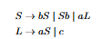
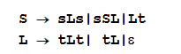
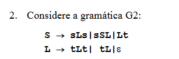
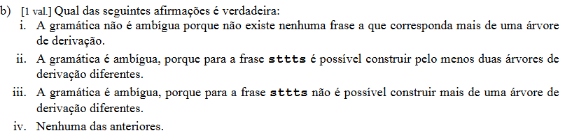

# Como descobrir se uma gramática é ambígua

Temos de conseguir construir duas àrovres diferentes para a mesma palavra. Basta começar com uma produção diferente para obter uma árvore diferente, veja:


**Se a primeira produção aplicada é diferente**, então as árvores de derivação serão necessariamente diferentes.

No teu exemplo:

```text
S -> bS
```

numa árvore, e:

```text
S -> Sb
```

na outra.

Logo, já no primeiro nível da árvore tens estruturas diferentes:

```text
      S
     / \
    b   S
```

versus

```text
      S
     / \
    S   b
```

Portanto, se ambas acabarem por gerar a **mesma palavra**, isso prova ambiguidade.


## As “regras-matriz” que eu procuraria

### 1. O mesmo não terminal pode crescer para a esquerda E para a direita

No primeiro exercício:

```text
S -> bS | Sb | aL
```

Tens:

```text
bS   ← põe b à esquerda
Sb   ← põe b à direita
```

Isto é logo um **sinal forte de perigo**.

Porque podes aplicar:

```text
S -> bS -> bSb
```

ou:

```text
S -> Sb -> bSb
```

Chegaste à mesma forma:

```text
bSb
```

por dois caminhos diferentes.

### Padrão a procurar

Se vires algo parecido com:

```text
A -> xA | Ax
```

fica logo desconfiado.

Especialmente se `A` também conseguir terminar:

```text
A -> alguma coisa sem A
```

---

### 2. Duas regras diferentes conseguem gerar a mesma quantidade/padrão de terminais

No segundo exercício:

```text
L -> tLt | tL | ε
```

Aqui tens duas maneiras diferentes de criar `t`.

Uma regra cria:

```text
t L t
```

ou seja, coloca **dois t** à volta.

Outra:

```text
t L
```

coloca **um t** de cada vez.

Como também tens:

```text
L -> ε
```

podes obter `tt` de duas maneiras:

```text
L => tLt => tt
```

ou:

```text
L => tL => ttL => tt
```

Isto prova que há sobreposição.

### Padrão a procurar

Quando vires:

```text
A -> xAx
A -> xA
A -> ε
```

ou regras recursivas semelhantes que conseguem produzir **a mesma palavra**, suspeita logo.

---

### 3. Procura alternativas do mesmo não terminal que “se sobrepõem”

Por exemplo:

```text
A -> α
A -> β
```

Pergunta:

> Existe alguma palavra que possa ser gerada tanto a partir de `α` como de `β`?

Se sim, pode haver ambiguidade.

Exemplo simples:

```text
A -> aA | aaA | ε
```

A palavra:

```text
aa
```

pode aparecer:

```text
A => aaA => aa
```

ou:

```text
A => aA => aaA => aa
```

Muito suspeito — e neste caso ambíguo.

---

### 4. ε juntamente com recursão merece atenção especial

Quando aparece:

```text
A -> ε
```

olha com atenção para as outras regras de `A`.

Porque `ε` permite “parar” a recursão em diferentes momentos.

No teu segundo exercício:

```text
L -> tLt | tL | ε
```

é precisamente `ε` que permite fechar:

```text
tLt
```

como:

```text
tt
```

e também fechar:

```text
tL -> ttL
```

como:

```text
tt
```

Portanto:

> **ε + várias formas de recursão = verificar logo se existem caminhos diferentes para a mesma palavra.**

---

### 5. Procura regras que podem ser aplicadas em ordens diferentes e chegar ao mesmo sítio

Isto aconteceu no primeiro exercício.

```text
S -> bS
S -> Sb
```

Ordem 1:

```text
S
=> bS
=> bSb
```

Ordem 2:

```text
S
=> Sb
=> bSb
```

Chegaste a:

```text
bSb
```

das duas formas.

É um excelente sinal para procurar uma palavra final comum.

---

## O procedimento rápido no exame

Quando te dão uma gramática e perguntam “é ambígua?”, faz mentalmente isto:

```text
1. Há duas ou mais regras para o mesmo não terminal?
                ↓
               SIM

2. Essas regras parecem conseguir gerar padrões semelhantes?
                ↓
               SIM

3. Há recursão à esquerda/direita, ou várias recursões diferentes?
                ↓
               SIM → muita atenção

4. Há ε?
                ↓
               SIM → vê se permite terminar caminhos diferentes

5. Tenta encontrar uma palavra PEQUENA produzida por dois caminhos.

6. Escreve duas derivações mais à esquerda diferentes.
```

Se conseguires o passo 6:

> **gramática ambígua.**

---

## Aplicando aos teus dois exercícios

### Exercício 1



```text
S -> bS | Sb | aL
```

Eu olharia imediatamente para:

```text
bS
Sb
```

porque tens o mesmo `S` e o mesmo terminal `b`, mas um coloca o `b` de cada lado.

Primeira pergunta:

> “Posso aplicar estas duas regras em ordens diferentes?”

Sim:

```text
S => bS => bSb
```

e:

```text
S => Sb => bSb
```

🔥 Forte sinal de ambiguidade.

Depois procuras terminar a palavra.

---

### Exercício 2



```text
L -> tLt | tL | ε
```

Eu olharia imediatamente para:

```text
tLt
tL
ε
```

e perguntaria:

> “Consigo produzir o mesmo número de `t` usando estas regras de maneiras diferentes?”

Sim:

```text
L => tLt => tt
```

e:

```text
L => tL => ttL => tt
```

🔥 Ambiguidade encontrada.

---

## A dica mais importante para decorar

Quando olhares para uma gramática, pergunta:

> **“Há duas maneiras estruturalmente diferentes de fabricar a mesma sequência de terminais?”**

Se sim, tenta demonstrar com uma palavra concreta.

E há três alarmes principais:

```text
A -> xA | Ax          ← crescimento dos dois lados

A -> xAx | xA | ε     ← recursões sobrepostas

A -> ... | ...        ← duas alternativas que podem gerar
                         a mesma sequência
```

Mas atenção a uma coisa importante: **ter duas regras que começam pelo mesmo terminal não prova ambiguidade**. Também não basta haver conflito LL(1). É apenas uma pista. A prova continua a ser: **mesma palavra, duas árvores de derivação distintas**.


---
---
--






Sim, **a resposta correta é a ii.**

A afirmação ii diz que a gramática é ambígua porque para a frase

```text
sttts
```

é possível construir **pelo menos duas árvores de derivação diferentes**.

E conseguimos fazê-lo.

Partimos em ambos os casos de:

```text
S -> sLs
```

porque precisamos de obter:

```text
s + ttt + s
```

A diferença está na forma como o `L` produz `ttt`.

**1.ª forma:**

```text
L -> tL
  -> ttL
  -> tttL
  -> ttt
```

Portanto:

```text
S
=> sLs
=> stLs
=> sttLs
=> stttLs
=> sttts
```

**2.ª forma:**

Usamos agora a regra diferente:

```text
L -> tLt
```

Então:

```text
S
=> sLs
=> stLts
=> sttLts
=> sttts
```

Aqui foram usadas:

```text
L -> tLt
L -> tL
L -> ε
```

As duas sequências chegam à mesma palavra:

```text
sttts
```

mas usam uma **estrutura diferente para desenvolver o `L`**. Logo dão origem a **duas árvores de derivação diferentes**.

Portanto:

```text
ii. A gramática é ambígua, porque para a frase sttts
é possível construir pelo menos duas árvores de derivação diferentes.
```

✅ **Resposta: ii.**

E atenção a um detalhe importante: **não basta haver duas sequências de derivação diferentes para provar ambiguidade; têm de corresponder a duas árvores diferentes.** Neste caso correspondem mesmo, porque numa árvore aparece a produção `L -> tLt` e na outra o `L` é desenvolvido apenas sucessivamente com `L -> tL`.
