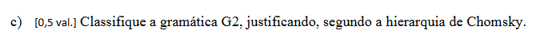

Sim. Vou explicar isto como um **teste de classificação**, isto é: o que tens de verificar numa gramática para poderes dizer “esta é Tipo 3”, “esta é Tipo 2”, etc. Vou seguir as regras apresentadas no PDF da disciplina. A hierarquia tem quatro classes: Tipo 3, Tipo 2, Tipo 1 e Tipo 0. 

Antes, fixa esta notação:

```text
A, B, S, L = não terminais
a, b, s, t = terminais
ε          = vazio

α, β, γ    = sequências quaisquer de símbolos
              (podem conter terminais e/ou não terminais)
```

Por exemplo, `α` poderia ser `abA`, `BC`, `tSx`, etc.

---

# TIPO 3 — Gramática regular

É o tipo com **mais restrições**.

Para uma gramática ser Tipo 3 linear à direita, **todas as produções têm de obedecer a uma destas formas**:

```text
A -> a
A -> aB
A -> ε
```

O PDF define `A` e `B` como não terminais singulares e `a` como um terminal singular. 

Agora os critérios, um por um.

### Critério 1 — do lado esquerdo tem de existir exatamente um não terminal

Isto é permitido:

```text
A -> ...
```

Isto não é:

```text
AB -> ...
```

nem:

```text
aA -> ...
```

porque o lado esquerdo já não é simplesmente um único não terminal.

### Critério 2 — se houver um não terminal do lado direito, só pode haver um

Permitido:

```text
A -> aB
```

Tem um único não terminal: `B`.

Não permitido como Tipo 3:

```text
A -> aBC
```

porque aparecem dois não terminais:

```text
B C
```

### Critério 3 — Na Gramática linear à direita, o não terminal tem de aparecer no fim

Permitido:

```text
A -> aB
```

porque:

```text
a B
  ↑
não terminal no fim
```

Não permitido:

```text
A -> aBb
```

porque:

```text
a B b
  ↑
não terminal no meio
```

### Critério 4 — pode existir uma produção só com um terminal

Isto é válido:

```text
A -> a
```

Significa que a produção termina naquele terminal.

### Critério 5 — `ε` é permitido, mas NÃO é obrigatório

Isto é muito importante por causa da tua dúvida anterior.

Uma gramática Tipo 3 **não precisa de ter**:

```text
A -> ε
```

O PDF está a dizer que `A -> ε` é uma **forma permitida**, não uma regra que obrigatoriamente tem de existir.

Por exemplo:

```text
S -> aA
A -> b
```

pode perfeitamente ser Tipo 3 sem ter `ε`.

---

# Gramática Tipo 3 Linear à esquerda 

Também existe Tipo 3 **linear à esquerda**. A diferença é simplesmente a posição do não terminal:

```text
A -> a
A -> Ba
A -> ε
```

Aqui, se existir um não terminal do lado direito, aparece à esquerda. 

Portanto, pensa assim:

```text
LINEAR À DIREITA:

A -> aB
     ↑↑
     terminal + não terminal


LINEAR À ESQUERDA:

A -> Ba
     ↑↑
     não terminal + terminal
```

### Teste rápido do Tipo 3

Se encontrares uma regra como:

```text
A -> aBb
```

já sabes:

**não é Tipo 3 nessa forma**, porque o não terminal está no meio.

Se encontrares:

```text
A -> BC
```

também não, porque tens dois não terminais do lado direito.


# Mas não pode haver apenas um não terminal à direita, mas no meio de simbolos terminais, ou seja, não ser linear à esquerda nem à direita, por exemplo A -> aBb


**Não**

Numa gramática de **Tipo 3 (regular)**, as produções têm de ser lineares:

* **linear à direita**: o único não terminal, se existir, aparece no fim
* **linear à esquerda**: o único não terminal, se existir, aparece no início

Exemplos válidos:

```text
A -> aB
A -> a
```

ou:

```text
A -> Ba
A -> a
```

Mas isto:

```text
A -> aBb
```

não é Tipo 3, porque o não terminal `B` está no meio.


---

# TIPO 2 — Gramática independente do contexto

Agora desaparecem muitas das restrições do Tipo 3.

A forma é:
  
```text
A -> α
```

O PDF diz que:

* `A` tem de ser **um único não terminal**;
* `α` pode ser uma **sequência arbitrária de terminais e não terminais**. 

## Critério essencial do Tipo 2

Olha principalmente para **o lado esquerdo de TODAS as produções**.

Tem de existir:

> **exatamente um único não terminal.**

Por exemplo:

```text
A -> aBb
```

é perfeitamente permitido em Tipo 2.

Porquê?

Porque do lado esquerdo tens:

```text
A
```

um único não terminal.

E o lado direito pode ser complexo:

```text
a B b
```

Não faz mal.

Também podes ter:

```text
A -> ABC
A -> abCDxy
A -> a
A -> ε
```

Do lado direito há grande liberdade.

---

## O que faria uma gramática deixar de ser Tipo 2?

Por exemplo:

```text
AB -> a
```

Não é Tipo 2.

Porquê?

Porque do lado esquerdo tens:

```text
A B
```

dois não terminais.

Outro exemplo:

```text
aA -> b
```

também não é Tipo 2 porque o lado esquerdo não é **um único não terminal**.

Portanto a pergunta fundamental para Tipo 2 é:

> **Todas as regras têm exatamente um não terminal sozinho à esquerda da seta?**

Se sim, a gramática satisfaz a forma de Tipo 2.

---

# Porque se chama “independente do contexto”?

Imagina:

```text
A -> aBb
```

Se aparece `A` numa frase:

```text
xxAyy
```

podes aplicar a regra e obter:

```text
xxaBbyy
```

Não precisaste de perguntar:

> “O que está antes do A?”
> “O que está depois do A?”

A regra diz simplesmente:

```text
A -> aBb
```

Sempre que encontrares `A`, podes substituí-lo.

Por isso é **independente do contexto**. O próprio PDF explica que qualquer ocorrência de `A` pode ser substituída independentemente do contexto. 

---

# TIPO 1 — Gramática dependente do contexto

Aqui muda uma coisa fundamental.

A produção pode depender daquilo que está **à volta** de um não terminal.

O PDF apresenta a forma:

```text
αAβ -> αγβ
```

onde:

* `A` é um único não terminal;
* `α` é o que está antes de `A`;
* `β` é o que está depois de `A`;
* `γ` é aquilo por que `A` vai ser substituído;
* `γ` não pode ser vazio. 

Vamos desmontar:

```text
α A β  ->  α γ β
```

Repara que:

```text
α       continua igual
β       continua igual
A       é substituído por γ
```

Mas essa substituição é feita **quando A está naquele contexto α...β**.

---

## Exemplo concreto

Suponhamos:

```text
aAb -> acb
```

Aqui:

```text
α = a
A = A
β = b
γ = c
```

Portanto:

```text
a A b
  ↓
a c b
```

Isto significa que estamos a substituir `A` por `c` **quando A aparece entre `a` e `b`**.

Daí:

> dependente do contexto.

---

## Critério muito importante do Tipo 1 — não pode encurtar a frase

O PDF acrescenta explicitamente:

```text
|αAβ| <= |αγβ|
```


Estas barras `| |` aqui significam **comprimento**, isto é, quantidade de símbolos.

Por exemplo:

```text
AB -> abc
```

Temos:

```text
AB      = 2 símbolos
abc     = 3 símbolos
```

Então:

```text
2 <= 3
```

✅ não encurtou.

Mas:

```text
ABC -> a
```

tem:

```text
ABC = 3 símbolos
a   = 1 símbolo
```

Então:

```text
3 <= 1
```

é falso.

❌ Isso viola a condição apresentada para Tipo 1.

---

## E `ε`?

Aqui existe uma regra especial no PDF.

Em Tipo 1, normalmente a produção **não pode reduzir o comprimento**, logo não podes simplesmente fazer:

```text
A -> ε
```

porque estarias a passar de um símbolo para zero.

O PDF dá apenas esta exceção:

```text
S -> ε
```

pode ser permitida **se `S` for o símbolo inicial e não aparecer no lado direito de nenhuma produção**. 

Portanto:

```text
Tipo 1:
normalmente NÃO elimina símbolos.

Exceção específica:
S -> ε
nas condições indicadas no PDF.
```

---

# TIPO 0 — Gramática sem restrições

Agora chegámos à classe com menos restrições.

O PDF apresenta:

```text
α -> β
```

onde `α` e `β` podem ser sequências arbitrárias de terminais e não terminais.

A única restrição explicitamente indicada no PDF é:

> **o lado esquerdo não pode ser vazio.** 

Portanto, no Tipo 0 já podes ter coisas como:

```text
AB -> aC
```

ou:

```text
aAB -> Ba
```

ou:

```text
ABC -> t
```

ou:

```text
aB -> ε
```

A estrutura é muito mais livre.

---

# Então quais são os critérios do Tipo 0?

Basicamente:

### Critério 1

O lado esquerdo:

```text
α
```

não pode ser vazio.

### Critério 2

Fora isso, segundo a forma apresentada no PDF, tanto o lado esquerdo como o direito podem ser sequências arbitrárias de terminais e não terminais. 

Não tens a restrição:

```text
um único não terminal à esquerda
```

do Tipo 2.

Nem tens a restrição de não diminuir o comprimento do Tipo 1.

Nem tens a estrutura muito rígida do Tipo 3.

Por isso é chamado:

> **Tipo 0 — livre ou sem restrições.**

---

# Agora o quadro que realmente deves memorizar

| Tipo                             | Para ser deste tipo, o que tenho de verificar?                                                                                                                                                                                                                            |          |    |         |                                                 |
| -------------------------------- | ------------------------------------------------------------------------------------------------------------------------------------------------------------------------------------------------------------------------------------------------------------------------- | -------- | -- | ------- | ----------------------------------------------- |
| **3 — Regular**                  | Todas as produções têm de respeitar a forma regular: `A -> a`, `A -> aB`, `A -> ε` (linear à direita) ou a correspondente forma linear à esquerda `A -> Ba`. Um único não terminal do lado esquerdo e, se houver não terminal à direita, no máximo um e numa extremidade. |          |    |         |                                                 |
| **2 — Independente do contexto** | **Cada lado esquerdo tem de ser exatamente um único não terminal:** `A -> α`. O lado direito `α` pode ser uma sequência arbitrária de terminais e não terminais.                                                                                                          |          |    |         |                                                 |
| **1 — Dependente do contexto**   | Produções da forma `αAβ -> αγβ`; a substituição de `A` pode depender do contexto `α` e `β`. `γ` não é vazio e a produção não pode diminuir o comprimento: `                                                                                                               | esquerda | <= | direita | `, salvo a exceção de `S -> ε` indicada no PDF. |
| **0 — Sem restrições**           | Produções gerais `α -> β`. O lado esquerdo não pode ser vazio; fora isso, o PDF permite sequências arbitrárias dos dois lados.                                                                                                                                            |          |    |         |                                                 |

   

---

# Como classificas uma gramática num exame?

Esta é talvez a parte mais útil.

Começa pelo tipo **mais restritivo**, o Tipo 3.

### Pergunta 1: é Tipo 3?

Verifica **todas as regras**.

Por exemplo:

```text
S -> aA
A -> bA
A -> b
```

Todas encaixam nas formas de Tipo 3.

Então:

```text
Tipo 3 ✅
```

Acabou.

---

Se encontrares:

```text
S -> aAb
```

isso já não encaixa em Tipo 3.

Então perguntas:

### Pergunta 2: é Tipo 2?

Olha para o lado esquerdo:

```text
S -> aAb
↑
um único não terminal
```

Sim.

Se **todas** as regras forem assim:

```text
A -> qualquer coisa
```

então:

```text
Tipo 2 ✅
```

---

Se aparecer:

```text
AB -> ...
```

já não podes dizer Tipo 2, porque:

```text
AB
```

não é um único não terminal.

Então tens de verificar as condições do Tipo 1.

Se também não cumprir as condições do Tipo 1, sobra o Tipo 0, desde que cumpra a regra geral apresentada no PDF.

---

# Finalmente, o teu G2

Tens:

```text
S -> sLs | ssL | Lt
L -> tLt | tL | ε
```

### Testamos Tipo 3

Esta regra:

```text
S -> sLs
```

tem:

```text
s L s
  ↑
não terminal no meio
```

Não corresponde a:

```text
A -> a
A -> aB
A -> ε
```

nem à forma linear à esquerda.

Portanto:

```text
Tipo 3 ❌
```

### Testamos Tipo 2

Olha para TODOS os lados esquerdos:

```text
S -> ...
S -> ...
S -> ...

L -> ...
L -> ...
L -> ...
```

Sempre temos exatamente:

```text
S
```

ou:

```text
L
```

ou seja, **um único não terminal**.

Portanto todas as produções têm a forma:

```text
A -> α
```

Logo:

> **G2 é uma gramática Tipo 2 — independente do contexto.** 

E agora a justificação já não é “porque parece Tipo 2”. É:

> **Não é Tipo 3 porque regras como `S -> sLs` e `L -> tLt` não respeitam a forma das gramáticas regulares. É Tipo 2 porque em todas as produções o lado esquerdo é constituído por exatamente um único não terminal, enquanto o lado direito pode ser uma sequência arbitrária de terminais e não terminais.**


A resposta da alínea c) é:

> **A gramática G2 é uma gramática de Tipo 2 — independente do contexto.**


