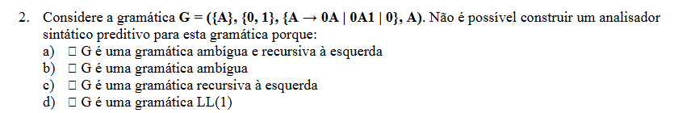

**O analisador sintático não cria a gramática — ele usa a gramática que já foi definida.**

# Distinção entre lexema, token e a relação com os símbolos das gramáticas


```text
LEXEMA
TOKEN
SÍMBOLO DA GRAMÁTICA
```

No contexto do analisador sintático, a relação correta é:

> **Os tokens correspondem aos símbolos terminais da gramática.**
> **Os lexemas são os textos concretos do programa que foram classificados nesses tokens.**
> **Os não terminais são categorias sintáticas criadas pela gramática**, como `ATRIBUIÇÃO`, `EXPRESSÃO`, `INSTRUÇÃO`, etc.

Usando o exemplo:

```text
x = 25;
```

O analisador léxico vê estes **lexemas**:

```text
x
=
25
;
```

Lexema significa simplesmente: **os caracteres concretos que apareceram no código**.

Depois classifica cada lexema num **token**:

```text
LEXEMA        TOKEN

x             IDENTIFICADOR
=             ATRIBUIÇÃO
25            NÚMERO
;             PONTO_E_VÍRGULA
```

Depois, o analisador sintático recebe essencialmente:

```text
IDENTIFICADOR ATRIBUIÇÃO NÚMERO PONTO_E_VÍRGULA
```

Agora entra a gramática. Por exemplo:

```text
INSTRUÇÃO -> IDENTIFICADOR ATRIBUIÇÃO NÚMERO PONTO_E_VÍRGULA
```

Aqui:

```text
INSTRUÇÃO
```

é **não terminal**.

Enquanto:

```text
IDENTIFICADOR
ATRIBUIÇÃO
NÚMERO
PONTO_E_VÍRGULA
```

são **terminais**.

Portanto:

```text
Código:
x = 25;

        ↓ análise léxica

Lexemas:
x      =      25      ;

        ↓ são classificados

Tokens:
IDENTIFICADOR  ATRIBUIÇÃO  NÚMERO  PONTO_E_VÍRGULA

        ↓ análise sintática

Gramática:
INSTRUÇÃO -> IDENTIFICADOR ATRIBUIÇÃO NÚMERO PONTO_E_VÍRGULA
↑                    ↑
não terminal         terminais
```

### Então onde entram os lexemas?

Os lexemas **não são “não terminais”**.

E, neste contexto, normalmente nem dizemos que o lexema é um símbolo da gramática sintática.

O lexema é o **exemplo concreto** que pertence a uma categoria/token.

Por exemplo:

```text
x
idade
contador
total
```

são quatro lexemas diferentes, mas todos podem ter o mesmo token:

```text
IDENTIFICADOR
```

Da mesma maneira:

```text
25
7
918
0
```

são lexemas diferentes, mas pertencem todos ao token:

```text
NÚMERO
```


É muito mais correto dizer:

> **tokens → terminais da gramática sintática**
> **não terminais → categorias estruturais da gramática**
> **lexemas → texto concreto do programa que originou os tokens**

Este ponto é mesmo fundamental para não baralhar análise léxica com análise sintática.


# O que é a gramática

Uma linguagem de programação tem regras que dizem quais construções são permitidas.

Por exemplo, poderíamos definir uma linguagem muito simples com esta regra:

```text
ATRIBUIÇÃO → IDENTIFICADOR = NÚMERO ;
```
**Isto é uma produção - uma regra da gramática**

Isto está a dizer:

> Uma atribuição válida é formada por um identificador, seguido de `=`, seguido de um número e terminado por `;`.

Esta regra faz parte da **gramática da linguagem**.

O teu PDF define precisamente uma gramática como um conjunto de regras segundo as quais são construídas as frases válidas da linguagem. 

Se receber:

```c
x = ;
```

os tokens seriam aproximadamente:

```text
IDENTIFICADOR   =   ;
```

Mas a gramática exigia:

```text
IDENTIFICADOR = NÚMERO ;
```

Está a faltar `NÚMERO`.

Então o analisador sintático conclui:

> ❌ Erro sintático.

Nos PDFs isto também aparece: a **análise sintática aplica regras gramaticais** e deteta sequências ilegais de tokens. 


### Vamos supor que a linguagem tem estas regras:

```text
INSTRUÇÃO → IDENTIFICADOR ATRIBUIÇÃO EXPRESSÃO PONTO_E_VÍRGULA

EXPRESSÃO → NÚMERO SOMA NÚMERO
```

Aqui temos os dois conceitos que estavam a causar confusão.

### Terminais

São:

```text
IDENTIFICADOR
ATRIBUIÇÃO
NÚMERO
SOMA
PONTO_E_VÍRGULA
```

Porquê?

Porque são os símbolos que podem ser **comparados diretamente com os tokens da entrada**.

Por exemplo:

```text
gramática espera: IDENTIFICADOR
entrada contém:   IDENTIFICADOR
```

Há correspondência.

O PDF chama aos terminais os símbolos pertencentes a `Σ`. 

---

### Não terminais

São:

```text
INSTRUÇÃO
EXPRESSÃO
```

Estes **não são tokens recebidos da análise léxica**.

O analisador léxico nunca envia:

```text
EXPRESSÃO
```

Ele envia coisas como:

```text
NÚMERO SOMA NÚMERO
```

`EXPRESSÃO` é uma categoria criada na **gramática** para dizer:

> uma determinada combinação de terminais e/ou outros não terminais forma uma expressão.

Por exemplo:

```text
EXPRESSÃO → NÚMERO SOMA NÚMERO
```

Portanto:

> **Terminal = pode ser confrontado diretamente com a entrada.**

> **Não terminal = representa uma estrutura definida por regras da gramática.**

O PDF chama aos não terminais **variáveis/símbolos não terminais**, pertencentes a `V`. 

---

# 3. Agora: como é que um parser LL preditivo trabalha?

Aqui é que a distinção com LR fica importante.

O parser **recebe os tokens**, sim:

```text
IDENTIFICADOR ATRIBUIÇÃO NÚMERO SOMA NÚMERO PONTO_E_VÍRGULA
```

Mas num parser **LL/top-down**, ele **não começa por transformar esses tokens em não terminais**.

Começa pelo **símbolo inicial da gramática**.

Vamos supor que o símbolo inicial é:

```text
INSTRUÇÃO
```

Portanto temos:

```text
GRAMÁTICA: começa em INSTRUÇÃO

ENTRADA:
IDENTIFICADOR ATRIBUIÇÃO NÚMERO SOMA NÚMERO PONTO_E_VÍRGULA
↑
próximo token
```

O parser consulta a regra:

```text
INSTRUÇÃO
→ IDENTIFICADOR ATRIBUIÇÃO EXPRESSÃO PONTO_E_VÍRGULA
```

Então passa a esperar isto:

```text
IDENTIFICADOR ATRIBUIÇÃO EXPRESSÃO PONTO_E_VÍRGULA
```

---

## 4. Agora começa a comparação com os tokens

Primeiro símbolo esperado:

```text
IDENTIFICADOR
```

Primeiro token recebido:

```text
IDENTIFICADOR
```

Coincidem:

```text
esperava IDENTIFICADOR
recebeu  IDENTIFICADOR
✅
```

O token é consumido.

Agora resta a entrada:

```text
ATRIBUIÇÃO NÚMERO SOMA NÚMERO PONTO_E_VÍRGULA
↑
```

E a gramática espera:

```text
ATRIBUIÇÃO EXPRESSÃO PONTO_E_VÍRGULA
↑
```

Coincidem novamente:

```text
ATRIBUIÇÃO = ATRIBUIÇÃO ✅
```

Consome.

---

# 5. Depois chega a EXPRESSÃO

Agora a gramática espera:

```text
EXPRESSÃO
```

Mas a entrada contém:

```text
NÚMERO
```

Aqui não podemos fazer:

```text
EXPRESSÃO = NÚMERO
```

porque `EXPRESSÃO` é um **não terminal**.

Então o parser consulta uma regra para `EXPRESSÃO`:

```text
EXPRESSÃO → NÚMERO SOMA NÚMERO
```

E substitui:

```text
EXPRESSÃO
```

por:

```text
NÚMERO SOMA NÚMERO
```

Agora aquilo que espera passa a ser:

```text
NÚMERO SOMA NÚMERO PONTO_E_VÍRGULA
```

E o que ainda recebeu é:

```text
NÚMERO SOMA NÚMERO PONTO_E_VÍRGULA
```

Então:

```text
NÚMERO = NÚMERO ✅
SOMA = SOMA ✅
NÚMERO = NÚMERO ✅
PONTO_E_VÍRGULA = PONTO_E_VÍRGULA ✅
```

Chegámos ao fim.

A frase é aceite.

---

# 6. Portanto, no LL aconteceu isto

A direção da construção foi:

```text
INSTRUÇÃO
      ↓
IDENTIFICADOR ATRIBUIÇÃO EXPRESSÃO PONTO_E_VÍRGULA
      ↓
IDENTIFICADOR ATRIBUIÇÃO NÚMERO SOMA NÚMERO PONTO_E_VÍRGULA
```

E essa última linha corresponde à entrada recebida.

Ou seja:

```text
NÃO TERMINAL INICIAL
        ↓
aplica regras
        ↓
terminais
        ↓
compara com os tokens recebidos
```

Isto é **top-down**.

O PDF diz que a descida recursiva pode ser usada para implementar parsers preditivos e associa estes parsers às gramáticas LL(1). 

---

# 7. Mas então para que serve o token seguinte no LL(1)?

Porque pode haver **mais do que uma regra para o mesmo não terminal**.

Por exemplo:

```text
EXPRESSÃO → NÚMERO SOMA NÚMERO
          | NÚMERO
```

Quando chega a:

```text
EXPRESSÃO
```

o parser precisa de decidir:

```text
uso EXPRESSÃO → NÚMERO SOMA NÚMERO ?

ou

uso EXPRESSÃO → NÚMERO ?
```

É aqui que entra a ideia **preditiva**: tenta decidir que produção usar olhando para a entrada.

No teu exercício original:

```text
A → 0A | 0A1 | 0
```

vendo apenas:

```text
0
```

não consegue escolher, porque as três alternativas começam por `0`.

É precisamente esse tipo de problema que o exercício está a explorar.

---

# 8. Agora vamos fazer o MESMO exemplo com LR / bottom-up

A entrada continua a ser exatamente a mesma:

```text
IDENTIFICADOR ATRIBUIÇÃO NÚMERO SOMA NÚMERO PONTO_E_VÍRGULA
```

E a gramática continua a ser:

```text
INSTRUÇÃO → IDENTIFICADOR ATRIBUIÇÃO EXPRESSÃO PONTO_E_VÍRGULA

EXPRESSÃO → NÚMERO SOMA NÚMERO
```

Mas o LR trabalha ao contrário.

Ele não parte de:

```text
INSTRUÇÃO
```

para gerar a frase.

Parte da **entrada** e tenta reconhecer nela partes que correspondem ao lado direito das regras.

---

## 9. Primeiro vê os tokens

Tem:

```text
IDENTIFICADOR ATRIBUIÇÃO NÚMERO SOMA NÚMERO PONTO_E_VÍRGULA
```

Repara nesta parte:

```text
NÚMERO SOMA NÚMERO
```

A gramática possui:

```text
EXPRESSÃO → NÚMERO SOMA NÚMERO
```

Portanto o parser pode reconhecer:

```text
NÚMERO SOMA NÚMERO
```

como sendo uma:

```text
EXPRESSÃO
```

Ou seja, faz uma **redução**:

```text
IDENTIFICADOR ATRIBUIÇÃO NÚMERO SOMA NÚMERO PONTO_E_VÍRGULA

                         ↓ reduz

IDENTIFICADOR ATRIBUIÇÃO EXPRESSÃO PONTO_E_VÍRGULA
```

Agora olha para a regra:

```text
INSTRUÇÃO →
IDENTIFICADOR ATRIBUIÇÃO EXPRESSÃO PONTO_E_VÍRGULA
```

Tem exatamente essa sequência.

Então reduz novamente:

```text
IDENTIFICADOR ATRIBUIÇÃO EXPRESSÃO PONTO_E_VÍRGULA

                         ↓

                     INSTRUÇÃO
```

Chegou ao símbolo inicial.

Aceita.

Os teus slides dizem que os parsers bottom-up, como **SLR/LALR/LR**, efetuam precisamente **reduções**, substituindo os símbolos correspondentes ao lado direito de uma regra pelo símbolo do lado esquerdo. 

---

# 10. Agora vê a diferença exata

### LL / top-down

Começou em:

```text
INSTRUÇÃO
```

e chegou aos tokens:

```text
INSTRUÇÃO
↓
IDENTIFICADOR ATRIBUIÇÃO EXPRESSÃO ;
↓
IDENTIFICADOR ATRIBUIÇÃO NÚMERO SOMA NÚMERO ;
```

Ou seja:

> **não terminal → terminais**

---

### LR / bottom-up

Começou nos tokens:

```text
IDENTIFICADOR ATRIBUIÇÃO NÚMERO SOMA NÚMERO ;
```

e chegou ao símbolo inicial:

```text
IDENTIFICADOR ATRIBUIÇÃO NÚMERO SOMA NÚMERO ;
↓
IDENTIFICADOR ATRIBUIÇÃO EXPRESSÃO ;
↓
INSTRUÇÃO
```

Ou seja:

> **terminais → não terminais → símbolo inicial**

---

# 11. E ambos recebem exatamente os mesmos tokens

Isto é o ponto que estava a causar a tua dúvida.

Tanto LL como LR recebem:

```text
IDENTIFICADOR
ATRIBUIÇÃO
NÚMERO
SOMA
NÚMERO
PONTO_E_VÍRGULA
```

A diferença **não é aquilo que recebem**.

A diferença é **como usam a gramática para analisar aquilo que receberam**.

```text
LL:
começa na gramática
e tenta chegar à entrada.

LR:
começa na entrada
e tenta reduzi-la ao símbolo inicial.
```

Portanto, se estivermos especificamente a falar de um **parser preditivo**, como no teu exercício, estamos no primeiro caso:

```text
LL / TOP-DOWN
```

Ele recebe os tokens, mas começa logicamente no **símbolo inicial**, vai expandindo não terminais e comparando os terminais obtidos com os tokens da entrada.


**Derivar** significa **aplicar as regras da gramática para ir transformando um símbolo noutros símbolos até chegar a uma palavra/frase formada só por terminais**.

A **derivação** é o **processo completo dessas transformações**.

No teu PDF, aparece esta notação:

```text
u ⇒ v
```

que significa:

> **u deriva em v num passo**

e também:

```text
u ⇒* v
```

que significa:

> **u deriva em v em zero ou mais passos**. 

Vamos usar uma gramática muito simples:

```text
S → 0A
A → 1
```

O símbolo inicial é `S`.

Começamos em:

```text
S
```

Aplicamos a regra:

```text
S → 0A
```

Logo:

```text
S ⇒ 0A
```

Dizemos:

> `S` **deriva em** `0A`.

Mas ainda temos `A`, que é um **não terminal**. Portanto ainda não terminámos.

Aplicamos:

```text
A → 1
```

e ficamos com:

```text
S ⇒ 0A ⇒ 01
```

Agora só temos:

```text
0
1
```

que são terminais.

Então terminou a **derivação**.

Ou seja:

* **derivar** = fazer uma substituição usando uma regra;
* **derivação** = sequência de substituições desde o símbolo inicial até obter uma palavra válida.

No teu exercício:

```text
A → 0A | 0A1 | 0
```

o símbolo inicial é `A`.

Uma derivação possível é:

```text
A
⇒ 0A
⇒ 00A
⇒ 000
```

Aqui fizemos:

```text
A → 0A
```

depois outra vez:

```text
A → 0A
```

e finalmente:

```text
A → 0
```

Portanto, `000` foi **derivada** a partir de `A`.

A forma mais simples de guardar isto é:

> **Derivar = aplicar uma regra.**
> **Derivação = o caminho inteiro de aplicações de regras até chegar à palavra final.**

E é por isso que o PDF diz que o **símbolo inicial** é o símbolo “a partir do qual todas as frases são derivadas”. 


Sim. A ideia-chave é muito simples:

> **O símbolo inicial é o não terminal a partir do qual somos obrigados a começar a aplicar as regras da gramática.**

O PDF diz precisamente que `S` representa o **“símbolo inicial a partir do qual todas as frases são derivadas”**. 

Imagina esta gramática:

```text
S → 0A
A → 1
```

Existem dois não terminais:

```text
S
A
```

Mas a gramática tem de dizer:

> “Qual deles uso primeiro?”

Se o **símbolo inicial for `S`**, então somos obrigados a começar assim:

```text
S
```

Depois usamos a regra:

```text
S → 0A
```

e obtemos:

```text
S ⇒ 0A
```

Depois:

```text
A → 1
```

e:

```text
S ⇒ 0A ⇒ 01
```

Portanto, o símbolo inicial é simplesmente o **ponto de partida**.

Agora repara numa coisa importante: **“S” em `G = (V, Σ, P, S)` é o nome que damos à posição “símbolo inicial” na definição geral. Não significa que o símbolo tenha obrigatoriamente de se chamar literalmente `S`.**

No teu exercício:

[
G=({A},{0,1},{A\rightarrow0A\mid0A1\mid0},A)
]

a estrutura geral é:

[
G=(V,\Sigma,P,S)
]

Então comparamos posição por posição:

```text
V = {A}
Σ = {0,1}
P = {A → 0A | 0A1 | 0}
S = A
```

Esse último:

```text
A
```

quer dizer:

> **O símbolo inicial desta gramática é A. Portanto, sempre que quisermos gerar uma palavra, começamos em A.**

Assim:

```text
A
↓
0A
↓
00A
↓
000
```

Nunca começamos diretamente em:

```text
0
```

nem em:

```text
1
```

porque `0` e `1` são terminais, não são o símbolo inicial.

Portanto, no teu exercício, guarda simplesmente:

> **Símbolo inicial = o não terminal onde começa a derivação.**

E aqui:

> **símbolo inicial = A.**


Sim. Agora vou explicar isto como uma **“aula 0 de gramáticas”**, mas usando os termos reais da disciplina. A ideia é que, no fim, consigas olhar para

[
G=({A},{0,1},{A\to0A\mid0A1\mid0},A)
]

e perceber sozinho porque a resposta é **b) G é uma gramática ambígua**.

Vou basear-me no PDF de Gramáticas. Só há um conceito que o PDF não define claramente com esse nome — **recursão à esquerda** — e aí vou acrescentar a definição necessária.

---

# 1. Para que serve uma gramática?

Estamos na parte de **análise sintática** de um compilador.

Recorda:

```text
programa
   ↓
análise léxica
   ↓
tokens
   ↓
ANÁLISE SINTÁTICA
   ↓
...
```

O analisador léxico reconhece os **tokens**.

Por exemplo, perante:

```c
x = 3 + 5;
```

poderia produzir algo semelhante a:

```text
IDENTIFICADOR   =
NÚMERO          +
NÚMERO          ;
```

Agora aparece outro problema:

> Como é que o compilador sabe se estes tokens estão numa **ordem permitida pela linguagem**?

É aí que entram as **gramáticas**.

O próprio PDF começa por dizer que uma gramática é usada para **descrever e analisar linguagens** e contém regras segundo as quais são construídas as frases válidas. 

Portanto:

**gramática = conjunto de regras que diz quais as estruturas/frases que uma linguagem permite.**

---

# 2. Um exemplo muito simples

Imagina que criamos uma linguagem extremamente pequena que só permite frases como:

```text
Pedro joga
Maria joga
```

Poderíamos definir:

```text
FRASE → NOME VERBO
NOME → Pedro | Maria
VERBO → joga
```

O símbolo `|` significa:

> **ou**

Portanto:

```text
NOME → Pedro | Maria
```

significa:

> NOME pode ser substituído por `Pedro` **ou** por `Maria`.

O PDF utiliza exatamente este tipo de notação e explica que `|` representa uma **alternativa**. 

---

# 3. O que significa a seta →?

Quando temos:

```text
NOME → Pedro
```

a seta significa aproximadamente:

> **NOME pode ser substituído por Pedro.**

Ou:

> **NOME produz Pedro.**

Estas regras chamam-se **produções**.

O PDF define uma produção genericamente como:

[
\alpha \rightarrow \beta
]

indicando que os símbolos do lado esquerdo podem ser substituídos pelos do lado direito. 


---

# 5. Agora conseguimos perceber `G = (V, Σ, P, S)`

O PDF diz que formalmente uma gramática é:

[
G=(V,\Sigma,P,S)
]

São **quatro coisas que definem completamente a gramática**. 

Vamos uma de cada vez.

### V — conjunto dos não terminais

Por exemplo:

```text
V = {A, B}
```

significa:

> nesta gramática existem dois símbolos não terminais: `A` e `B`.

---

### Σ — alfabeto / conjunto dos terminais

Esta letra é a letra grega **sigma**:

[
\Sigma
]

Por exemplo:

```text
Σ = {0,1}
```

significa:

> as frases finais desta linguagem são construídas utilizando `0` e `1`.

---

### P — produções

São as regras.

Por exemplo:

```text
A → 0A
A → 1
```

Estas regras dizem como podemos substituir `A`.

---

### S — símbolo inicial

Precisamos de saber:

> onde começa a derivação?

Esse símbolo chama-se **símbolo inicial**.

O PDF diz precisamente que `S` é o símbolo a partir do qual todas as frases são derivadas. 

Atenção: não significa que o símbolo inicial tenha obrigatoriamente de se chamar `S`.

Podemos ter:

```text
símbolo inicial = A
```

É exatamente isso que acontece no teu exercício.

---

# 6. Agora vamos decifrar a gramática do exercício

Tens:

[
G=({A},{0,1},{A\rightarrow0A\mid0A1\mid0},A)
]

Recorda a ordem:

[
G=(V,\Sigma,P,S)
]

Portanto:

```text
V = {A}

Σ = {0,1}

P = {A → 0A | 0A1 | 0}

S = A
```

Agora traduzimos isto.

### `V = {A}`

Só existe **um não terminal**:

```text
A
```

---

### `Σ = {0,1}`

Existem dois terminais:

```text
0
1
```

Portanto, as palavras finais serão constituídas por zeros e uns.

---

### `S = A`

Começamos sempre em:

```text
A
```

---

### As produções

Temos:

```text
A → 0A | 0A1 | 0
```

O `|` significa **ou**.

Logo isto são realmente três possibilidades:

```text
A → 0A

ou

A → 0A1

ou

A → 0
```

Sempre que encontrarmos `A`, podemos escolher **uma destas três regras**.

---

# 7. O que é uma derivação?

Agora começamos a utilizar as regras.

Isto chama-se **derivar**.

O PDF explica que:

```text
u ⇒ v
```

significa que `u` deriva em `v` num passo. 

Começamos obrigatoriamente no símbolo inicial:

```text
A
```

Podemos usar:

```text
A → 0
```

e obtemos:

```text
A ⇒ 0
```

Acabou.

Já não temos nenhum `A`.

Só temos um terminal.

Portanto:

```text
0
```

é uma palavra pertencente à linguagem desta gramática.

---

# 8. Podemos produzir `00`

Começamos:

```text
A
```

Escolhemos:

```text
A → 0A
```

Portanto:

```text
A ⇒ 0A
```

Ainda existe um `A`.

Precisamos de o substituir.

Escolhemos:

```text
A → 0
```

e ficamos com:

```text
A ⇒ 0A ⇒ 00
```

Logo:

```text
00
```

também pertence à linguagem.

---

# 9. E podemos produzir `001`

Começamos novamente:

```text
A
```

Agora usamos:

```text
A → 0A1
```

Então:

```text
A ⇒ 0A1
```

Ainda existe `A`.

Substituímos esse `A` por `0`:

```text
0A1
 ↓
001
```

Portanto:

```text
A ⇒ 0A1 ⇒ 001
```

E `001` também pertence à linguagem.

---

# 10. O que significa então “linguagem gerada pela gramática”?

É simplesmente:

> **o conjunto de todas as palavras que conseguimos produzir começando no símbolo inicial e aplicando as regras.**

O PDF define isto como `L(G)` — a linguagem gerada por `G`. 

No nosso caso aparecem, por exemplo:

```text
0
00
000
001
0001
00011
...
```

Não precisamos ainda de determinar exatamente todas as palavras possíveis para resolver o exercício.

---

# 11. O que é recursão?

Agora aparece uma palavra importante das opções.

Olha para:

```text
A → 0A
```

Começamos com `A` e, depois de aplicar a regra, **voltamos a ter A**.

Isto é uma forma de **recursão**.

Também acontece aqui:

```text
A → 0A1
```

`A` volta a aparecer.

Portanto:

> **Esta gramática é recursiva.**

Mas atenção:

**ser recursiva não significa automaticamente ser recursiva à esquerda.**

E é precisamente aí que poderias cair na armadilha da pergunta.

---

# 12. O que é recursão à esquerda?

Esta definição específica não aparece claramente desenvolvida no PDF, por isso esta parte é conhecimento adicional necessário para compreender a opção.

Uma **recursão direta à esquerda** acontece quando temos algo deste género:

```text
A → A alguma_coisa
```

Repara na posição do `A`.

Está **imediatamente à esquerda** do lado direito:

```text
A → A...
     ↑
```

Exemplo:

```text
A → A0
```

Isto é recursão à esquerda.

Outro:

```text
E → E + T
```

também é recursão à esquerda:

```text
E → E + T
     ↑
```

O mesmo não terminal `E` aparece imediatamente no início.

---

# 13. E `A → 0A`?

Agora olha para a nossa regra:

```text
A → 0A
```

O primeiro símbolo é:

```text
0
```

e só **depois** aparece `A`.

Portanto:

```text
A → 0A
     ↑
     primeiro aparece 0
```

**Não é recursão à esquerda.**

---

E:

```text
A → 0A1
```

também começa por:

```text
0
```

Não começa por `A`.

Logo também **não é recursão à esquerda**.

E:

```text
A → 0
```

nem sequer tem `A`.

Portanto, a nossa gramática **tem recursão**, mas **não tem recursão à esquerda**.

Isto já permite eliminar:

**c) G é uma gramática recursiva à esquerda ❌**

e também:

**a) G é uma gramática ambígua e recursiva à esquerda ❌**

Mesmo que descubramos que é ambígua, a segunda metade de `a)` é falsa.

---

# 14. Agora precisamos de saber o que é “ambígua”

Esta definição aparece diretamente no PDF.

O PDF diz:

> uma gramática é ambígua quando é possível obter **a mesma frase através de duas árvores de derivação distintas**. 

Traduzindo:

Se a gramática consegue construir exatamente a mesma palavra de **duas maneiras estruturalmente diferentes**, temos ambiguidade.

---

# 15. Vamos testar a nossa gramática

Temos:

```text
A → 0A
A → 0A1
A → 0
```

Vamos tentar produzir:

```text
0001
```

Primeira maneira:

```text
A
⇒ 0A
⇒ 00A1
⇒ 0001
```

Vê o que fizemos:

```text
A → 0A

depois:
A → 0A1

depois:
A → 0
```

Resultado:

```text
0001
```

---

# 16. Agora uma segunda maneira

Começamos outra vez em `A`:

```text
A
⇒ 0A1
⇒ 00A1
⇒ 0001
```

Agora fizemos:

```text
A → 0A1

depois:
A → 0A

depois:
A → 0
```

Resultado:

```text
0001
```

Outra vez!

Temos, portanto:

```text
CAMINHO 1

A
⇒ 0A
⇒ 00A1
⇒ 0001
```

e:

```text
CAMINHO 2

A
⇒ 0A1
⇒ 00A1
⇒ 0001
```

Os dois produzem exatamente:

```text
0001
```

mas não começaram pelas mesmas escolhas.

---

# 17. Porque é que isto prova ambiguidade?

Porque as **árvores de derivação são diferentes**.

Na primeira, a raiz utiliza:

```text
A → 0A
```

e só o `A` seguinte utiliza:

```text
A → 0A1
```

Temos aproximadamente:

```text
        A
       / \
      0   A
         /|\
        0 A 1
          |
          0
```

As folhas, lidas da esquerda para a direita:

```text
0 0 0 1
```

---

Na segunda derivação, logo na raiz usamos:

```text
A → 0A1
```

e depois:

```text
A → 0A
```

Temos:

```text
        A
       /|\
      0 A 1
       / \
      0   A
          |
          0
```

As folhas também são:

```text
0 0 0 1
```

Portanto:

**mesma palavra: `0001`**

mas:

**duas árvores diferentes.**

Segundo a definição do próprio PDF:

> **gramática ambígua.** 

Isto é a peça principal para responder à pergunta.

---

# 18. Agora: o que é um parser?

`Parser` é simplesmente o termo inglês utilizado para:

> **analisador sintático.**

Ele recebe os tokens e tenta verificar se a sequência respeita as regras da gramática.

Por exemplo, se tivermos uma gramática:

```text
S → 0A
A → 1
```

e recebermos:

```text
01
```

o parser consegue verificar:

```text
S
↓
0A
↓
01
```

Logo a frase é válida.

---


Sim. Para ficares orientado, nos teus PDFs aparecem essencialmente **duas grandes famílias de analisadores sintáticos**:

### 1. **Top-down** — de cima para baixo

Começam no **símbolo inicial da gramática** e tentam chegar à sequência de tokens que receberam.

Exemplo:

```text
S → AB
A → 0
B → 1
```

Para reconhecer `01`:

```text
S
⇒ AB
⇒ 0B
⇒ 01
```

Ou seja, começam em `S` e vão expandindo os **não terminais**.

Dentro desta família tens o **parser de descida recursiva**. O teu PDF diz que a descida recursiva pode implementar **parsers preditivos**. 

O **parser preditivo LL(1)** é um tipo de top-down que tenta escolher a regra certa olhando apenas para o próximo token:

```text
A → 0B | 1C
```

Se vê `0`, escolhe `0B`; se vê `1`, escolhe `1C`.

Portanto:

> **Top-down → descida recursiva → pode ser preditivo → LL(1).**

---

### 2. **Bottom-up** — de baixo para cima

Fazem essencialmente o contrário.

Começam pelos **tokens recebidos** e tentam reduzi-los até chegar ao símbolo inicial.

Com a mesma gramática:

```text
S → AB
A → 0
B → 1
```

recebem:

```text
01
```

e conceptualmente fazem:

```text
01
⇒ A1
⇒ AB
⇒ S
```

Aqui não estamos a **expandir** `S`.

Estamos a fazer o contrário: reconhecer pedaços da entrada e **reduzi-los** segundo as regras.

Nos teus slides aparecem explicitamente como parsers bottom-up:

**SLR, LALR e LR**. 

---

Portanto, para já, guarda este mapa:

```text
ANALISADORES SINTÁTICOS
│
├── TOP-DOWN
│     começa no símbolo inicial
│     e tenta chegar aos tokens
│
│     └── Descida recursiva
│            └── Parser preditivo
│                   └── LL(1)
│
└── BOTTOM-UP
      começa nos tokens
      e tenta chegar ao símbolo inicial

      ├── LR
      ├── SLR
      └── LALR
```

E a diferença essencial é mesmo esta:

> **LL / top-down:** `S → ... → frase`

> **LR / bottom-up:** `frase → ... → S`

Para o exercício que estávamos a resolver, quando aparece **“analisador sintático preditivo”**, deves imediatamente associar ao **top-down / LL(1)**, porque é exatamente essa associação que o PDF de Gramáticas apresenta. 

Não precisas ainda de saber as diferenças entre **LR, SLR e LALR** para aquele exercício.


Sim — e aqui vale a pena desmontar **LL(1)** peça por peça, porque não é um nome arbitrário. Cada parte diz **como o parser trabalha**.

Primeiro, o PDF diz literalmente que, em `LL(1)`, o primeiro `L` significa que a frase é processada da esquerda para a direita, o segundo `L` que se usa a derivação mais à esquerda, e o `(1)` que é usado um terminal de avanço para escolher entre produções alternativas. 

Agora vamos ao que isso realmente quer dizer.

## 1. O primeiro `L`

O primeiro `L` vem de **Left-to-right**.

Quer dizer:

> o parser lê a sequência de entrada da **esquerda para a direita**.

Por exemplo, se a entrada for:

```text
0 1 1 0
```

ele vai observar nessa ordem:

```text
0 → 1 → 1 → 0
```

e não:

```text
0 ← 1 ← 1 ← 0
```

Ou, num programa:

```c
x = 3 + 5;
```

a leitura é:

```text
x → = → 3 → + → 5 → ;
```

O primeiro `L` refere-se, portanto, **à direção em que a entrada é lida**.

### Existem outras possibilidades além desse `L`?

Em teoria, poderíamos imaginar processamentos da direita para a esquerda, mas **nas famílias de parsers que vais encontrar normalmente nesta matéria, tanto LL como LR começam por `L`**, porque ambos processam a entrada da esquerda para a direita.

Por isso vais encontrar sobretudo:

```text
LL
LR
```

e não deves pensar que:

```text
LL = uma coisa
RR = outra coisa muito comum
RL = outra...
```

Não é essa a classificação habitual estudada aqui.

O que realmente muda entre **LL** e **LR** é sobretudo a **segunda letra**.

---

# 2. O segundo `L`

O segundo `L` significa:

> **Leftmost derivation**

ou:

> **derivação mais à esquerda**.

Agora temos de ligar isto ao que já aprendeste sobre **derivação**.

Imagina esta gramática:

```text
S → AB
A → 0
B → 1
```

O símbolo inicial é:

```text
S
```

Aplicamos:

```text
S ⇒ AB
```

Agora existem **dois não terminais**:

```text
A B
```

Qual vamos substituir primeiro?

Se fazemos **derivação mais à esquerda**, escolhemos sempre o não terminal que está mais à esquerda.

Ou seja:

```text
AB
↑
A é o não terminal mais à esquerda
```

Então:

```text
S
⇒ AB
⇒ 0B
⇒ 01
```

Primeiro substituímos `A`, só depois `B`.

Isto é uma **derivação mais à esquerda**.

---

## 3. Então existe também derivação mais à direita?

Sim.

Chama-se:

> **Rightmost derivation**

ou:

> **derivação mais à direita**.

Usando exatamente a mesma gramática:

```text
S → AB
A → 0
B → 1
```

começamos:

```text
S ⇒ AB
```

Mas agora escolhemos primeiro o não terminal mais à direita:

```text
A B
  ↑
  B
```

Então:

```text
S
⇒ AB
⇒ A1
⇒ 01
```

Repara: chegámos à mesma palavra:

```text
01
```

mas a ordem das substituições foi diferente.

Portanto:

```text
L = Leftmost
    deriva sempre primeiro o não terminal mais à esquerda

R = Rightmost
    deriva sempre primeiro o não terminal mais à direita
```

É daqui que aparecem as famílias:

```text
LL
LR
```

---

# 4. Então qual é a diferença entre `LL` e `LR`?

Agora já conseguimos ler os nomes.

### `LL`

Primeiro `L`:

> lê a entrada da esquerda para a direita.

Segundo `L`:

> trabalha segundo uma derivação mais à esquerda.

Portanto:

```text
LL
││
│└─ Leftmost derivation
└── Left-to-right input
```

---

### `LR`

Primeiro `L`:

> também lê a entrada da esquerda para a direita.

Segundo `R`:

> está associado à derivação mais à direita, construída ao contrário.

Portanto:

```text
LR
││
│└─ Rightmost derivation
└── Left-to-right input
```

No teu PDF de análise semântica aparecem mesmo parsers `SLR/LALR/LR`, embora esse PDF não explique aí em detalhe estas siglas. 

Para **este exercício específico**, não precisas de aprender SLR e LALR já. Basta perceber que:

> `LL` não é “o único tipo de parser”. Há também a família `LR`.

---

# 5. Agora vamos ao `(1)`

Esta é uma parte completamente diferente das letras.

O número indica:

> **quantos tokens/terminais à frente o parser pode observar para decidir qual regra escolher.**

Isto chama-se **lookahead**, ou símbolo/token de avanço.

Vamos primeiro ver `LL(1)`.

Imagina:

```text
A → 0B | 1C
```

O parser está a tratar `A`.

A entrada pode começar por:

```text
0...
```

ou:

```text
1...
```

O parser olha para **um único terminal à frente**.

Se vê:

```text
0
```

sabe:

```text
A → 0B
```

Se vê:

```text
1
```

sabe:

```text
A → 1C
```

Um terminal foi suficiente.

Por isso é:

```text
LL(1)
```

---

# 6. Então existem LL(2), LL(3), etc.?

**Sim.**

De forma geral escrevemos:

```text
LL(k)
```

em que `k` é o número de tokens de avanço que podem ser necessários.

Assim:

```text
LL(1)
```

→ olha até **1 token** à frente.

```text
LL(2)
```

→ pode olhar até **2 tokens** à frente.

```text
LL(3)
```

→ pode olhar até **3 tokens** à frente.

E genericamente:

```text
LL(k)
```

→ olha até `k` tokens à frente.

O teu PDF fala especificamente de `LL(1)` e diz que o `(1)` representa o número de terminais de avanço necessários. 

A existência de `LL(2)`, `LL(3)`, `LL(k)` já é uma generalização da notação, não algo que esse slide desenvolva.

---

# 7. Porque é que às vezes 1 token não chega?

Imagina:

```text
A → 00B | 01C
```

Agora o parser está em `A`.

Olha para **um token**.

Vê:

```text
0
```

Mas as duas possibilidades começam por `0`:

```text
00B
01C
```

Portanto, com apenas um token, ainda não sabe qual escolher.

Tem de olhar também para o segundo.

Se vê:

```text
00
```

escolhe:

```text
A → 00B
```

Se vê:

```text
01
```

escolhe:

```text
A → 01C
```

Neste exemplo, intuitivamente precisámos de **2 símbolos de avanço**.

É esta a ideia por trás de `LL(2)`.

---

# 8. E LL(0)?

Também podemos falar conceptualmente de:

```text
LL(0)
```

Isso significa:

> o parser não precisa de olhar para nenhum token da entrada para escolher a produção.

Isso só funciona em situações muito restritas.

Por exemplo, se um não terminal tiver apenas uma produção:

```text
A → 0B
```

não existe escolha a fazer.

Ao tratar `A`, já sabes qual regra utilizar.

Mas, para a matéria do teu PDF, o importante é **LL(1)**.

---

# 9. O número não significa “qual símbolo está a ler”

Este é um erro fácil de cometer.

`LL(1)` **não quer dizer**:

> “lê o primeiro token”.

Também não quer dizer:

> “a gramática só pode ter um terminal”.

Nem:

> “usa a primeira produção”.

Significa:

> **pode consultar 1 token à frente da posição atual para decidir qual produção aplicar.**

---

# 10. Agora voltamos à gramática do exercício

Temos:

```text
A → 0A | 0A1 | 0
```

Estamos em `A`.

A entrada começa por:

```text
0
```

Um parser `LL(1)` pode olhar para **1 token**:

```text
0
```

Agora pergunta:

> Qual regra escolho?

Mas tem:

```text
A → 0A
A → 0A1
A → 0
```

Todas começam por:

```text
0
```

Portanto, esse único `0` **não lhe dá informação suficiente**.

É por isso que esta gramática, tal como está escrita, **não é LL(1)**.

---

# 11. Mas atenção: isto não significa automaticamente que seja LL(2)

Aqui está uma distinção importante.

Podias pensar:

> “Se 1 não chega, então 2 deve chegar.”

Não necessariamente.

Por exemplo, nesta gramática:

```text
A → 0A | 0A1 | 0
```

como `A` pode voltar a produzir mais `0`s, as alternativas podem continuar difíceis de distinguir.

Por isso não devemos afirmar simplesmente:

```text
não é LL(1) → então é LL(2)
```

Isso é falso em geral.

---

# 12. Como podes ler uma sigla destas no exame?

Sempre que aparecer:

```text
LL(1)
```

lê literalmente:

> **“Parser que lê a entrada da esquerda para a direita, trabalha com derivação mais à esquerda e utiliza um token de avanço.”**

Se aparecer:

```text
LL(2)
```

lê:

> **“Esquerda para a direita, derivação mais à esquerda, até dois tokens de avanço.”**

Se aparecer:

```text
LR(1)
```

lê:

> **“Esquerda para a direita, associado à derivação mais à direita, com um token de avanço.”**

---

## O mapa que quero que guardes

```text
             LL(1)
             │ │ │
             │ │ └── 1 token de lookahead
             │ │
             │ └──── Leftmost derivation
             │       derivação mais à esquerda
             │
             └────── Left-to-right
                     lê a entrada da esquerda
                     para a direita
```

As principais variações que faz sentido conhecer agora são:

```text
Segundo carácter:

LL → derivação mais à esquerda
LR → derivação mais à direita (em sentido inverso no parser)

Número:

(0) → 0 tokens de avanço
(1) → 1 token de avanço
(2) → 2 tokens de avanço
(3) → 3 tokens de avanço
...
(k) → k tokens de avanço
```

E para **o teu exercício**, basta perceber `LL(1)`: o PDF diz que um parser preditivo deve conseguir escolher a produção conhecendo o não terminal atual e o terminal a processar; no caso de `A → 0A | 0A1 | 0`, ao ver `0` há três alternativas possíveis, por isso essa escolha não é possível com um único símbolo de avanço. 


Logo:

**d) ❌**


---

# 25. Resposta final

A resposta correta é:

**✅ b) G é uma gramática ambígua.**

A justificação diretamente baseada na matéria do PDF é que uma gramática é ambígua quando uma mesma frase admite duas árvores de derivação distintas. 

Nesta gramática, a palavra `0001` pode ser obtida de duas maneiras:

```text
A ⇒ 0A ⇒ 00A1 ⇒ 0001
```

e:

```text
A ⇒ 0A1 ⇒ 00A1 ⇒ 0001
```

Logo, a gramática é **ambígua**.

