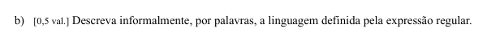

Aqui “**descrever informalmente, por palavras**” quer dizer simplesmente:

> **explicar em português normal que tipo de palavras a expressão regular aceita, sem usar fórmulas.**

A expressão era:

```text
(ab*)+c?
```

Vamos traduzi-la por partes:

```text
b*
```

= zero ou mais `b`

Logo:

```text
ab*
```

= um `a` seguido de zero ou mais `b`

Depois:

```text
(ab*)+
```

= um ou mais blocos desse tipo

E:

```text
c?
```

= no fim pode aparecer zero ou um `c`

Portanto, uma boa resposta informal seria:

> **A linguagem é constituída por palavras formadas por um ou mais blocos, cada bloco começando por `a` e podendo ser seguido por zero ou mais `b`, podendo ainda existir um único `c` no final.**

Exemplos:

```text
a
ab
abb
aa
abab
aaabbb
ac
abc
abbc
```

O que **não** pode acontecer:

```text
c        ❌ porque tem de existir pelo menos um bloco ab*
bbc      ❌ porque cada bloco começa por a
abcc     ❌ porque c? permite no máximo um c
abcd     ❌ porque d nem pertence à expressão
```

Portanto, **“informalmente” = explicar a regra por palavras**, em vez de escrever algo matemático como um conjunto formal de cadeias.

Para este exercício, eu escreveria exatamente:

> **Palavras constituídas por um ou mais grupos formados por `a` seguido de zero ou mais `b`, podendo terminar opcionalmente num único `c`.**
