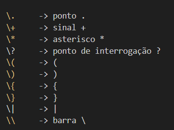
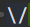

Sim. Este exercício junta várias regras numa **única expressão regular**. O mais seguro é construí-la por partes e só depois juntar tudo.

O formato obrigatório é:

```text
SSD-<Marca>-<Modelo>-<Formato>-<Interface>-<Capacidade>[-<Extra>]
```

O PDF confirma as ferramentas que vamos usar: `[a-zA-Z]` para intervalos de caracteres, `[0-9]` para dígitos, `|` para alternativas, `?` para algo opcional e `*` para zero ou mais ocorrências.  

## 1. `SSD-`

Isto é sempre obrigatório e exatamente assim:

```regex
SSD-
```

Não há nenhuma escolha aqui.

---

## 2. Marca

O enunciado diz:

> entre **3 e 20 símbolos alfanuméricos**.

Alfanumérico significa:

```text
a-z    letras minúsculas
A-Z    letras maiúsculas
0-9    algarismos
```

Logo:

```regex
[A-Za-z0-9]{3,20}
```


Claro.

```text
[A-Za-z0-9]
```

significa:

> **aceitar exatamente 1 carácter que seja uma letra ou um algarismo.**

Por partes:

```text
A-Z
```

= qualquer letra maiúscula:

```text
A, B, C, ..., Z
```

```text
a-z
```

= qualquer letra minúscula:

```text
a, b, c, ..., z
```

```text
0-9
```

= qualquer algarismo:

```text
0, 1, 2, ..., 9
```

Os `[ ]` significam:

> **escolher um carácter de entre os que estão dentro.**

Portanto:

```text
[A-Za-z0-9]
```

aceita, por exemplo:

```text
A ✅
g ✅
Z ✅
4 ✅
9 ✅
```

Mas não aceita:

```text
- ❌
_ ❌
@ ❌
espaço ❌
```

`{3,20}` significa:

> repetir aquilo que vem antes **no mínimo 3 e no máximo 20 vezes**.

Por exemplo:

```text
PNY        ✅
Crucial    ✅
Kingston1  ✅
AB         ❌ só tem 2 caracteres
```

O PDF ensina `[a-zA-Z]` e `[0-9]` como abreviaturas para conjuntos de caracteres. A notação `{3,20}` não aparece explicitamente nos slides que encontrei; é notação regex padrão para indicar um intervalo de repetições. 

Portanto:

```regex
SSD-[A-Za-z0-9]{3,20}-
```

---

## 3. Modelo

Tem exatamente a mesma condição da marca:

```regex
[A-Za-z0-9]{3,20}
```

Ficamos com:

```regex
SSD-[A-Za-z0-9]{3,20}-[A-Za-z0-9]{3,20}-
```

Isto já aceitaria, por exemplo:

```text
SSD-PNY-CS900-
SSD-Crucial-P20-
```

---

## 4. Formato e Interface — aqui está a principal armadilha

O formato pode ser:

```text
2.5
M.2
```

A interface pode ser:

```text
SATA
PCIe
```

Mas o enunciado acrescenta:

> **2.5 só com interface SATA**

Portanto, **não podemos** escrever simplesmente:

```regex
(2\.5|M\.2)-(SATA|PCIe)
```

porque isso aceitaria:

```text
2.5-PCIe ❌
```

e o enunciado proíbe essa combinação.

Temos de escrever as combinações válidas:

```text
2.5-SATA       ✅

M.2-SATA       ✅
M.2-PCIe       ✅
```

Logo:

```regex
(2\.5-SATA|M\.2-(SATA|PCIe))
```

O `|` significa **ou**.

Portanto:

```text
2\.5-SATA

OU

M\.2-SATA
OU
M\.2-PCIe
```

O `\.` significa **um ponto literal**. Em regex, `.` costuma ter um significado especial ("qualquer carácter"), por isso colocamos `\` para dizer que queremos mesmo o carácter `.`.


## Símbolos que normalmente têm significado especial

Fora de [ ], os principais são:

.   ^   $   *   +   ?   (   )   [   ]   {   }   |   \

Se quiseres esses caracteres literalmente, normalmente tens de os escapar.


Exemplos:




## Porque é que o ponto "." é um caracter especial

O ponto `.` tem um significado especial nas expressões regulares:

> **`.` = qualquer carácter**

Por exemplo, a regex:

```text
a.b
```

aceita:

```text
acb
a1b
a-b
a_b
```

porque o `.` pode representar qualquer carácter entre `a` e `b`.

Mas se tu quiseres reconhecer literalmente:

```text
a.b
```

ou seja, a letra `a`, depois mesmo um ponto `.`, depois `b`, tens de escrever:

```text
a\.b
```

A barra `\` serve para dizer:

> “não interpretes o `.` como operador especial; quero mesmo o carácter ponto.”

Então:

```text
.
```

= qualquer carácter

```text
\.
```

= o carácter ponto `.`

Exemplo do exercício que vimos:

```text
M.2
```

Se escreveres:

```text
M.2
```

poderia aceitar também:

```text
Ma2
M12
M-2
```

porque `.` significa qualquer carácter.

Para aceitar especificamente:

```text
M.2
```

escreves:

```text
M\.2
```

A regra para guardar é:

> **Quando um símbolo tem significado especial na regex e tu queres esse símbolo literalmente, colocas `\` antes dele.**


Até aqui:

```regex
SSD-[A-Za-z0-9]{3,20}-[A-Za-z0-9]{3,20}-(2\.5-SATA|M\.2-(SATA|PCIe))-
```

---

## 5. Capacidade em GB

O enunciado diz:

> inteiro entre **100 e 999**, terminado em `GB`.

Um número entre 100 e 999 tem:

```text
primeiro algarismo: 1 até 9
segundo:             0 até 9
terceiro:            0 até 9
```

Logo:

```regex
[1-9][0-9][0-9]GB
```

Podemos abreviar os dois últimos:

```regex
[1-9][0-9]{2}GB
```

Exemplos:

```text
100GB ✅
250GB ✅
999GB ✅

99GB   ❌
1000GB ❌
```

---

## 6. Ou capacidade em TB

O enunciado só permite:

```text
1TB
2TB
4TB
8TB
```

Logo podemos usar:

```regex
[1248]TB
```

`[1248]` significa:

> um carácter que pode ser `1`, `2`, `4` ou `8`.

Portanto a capacidade completa é:

```regex
([1-9][0-9]{2}GB|[1248]TB)
```

Isto significa:

> 100–999 GB **OU** 1, 2, 4 ou 8 TB.

---


# O que signfiica o ^ no inicio da expressão e $ no fim

## ^ 

Em regex, o símbolo `^` tem **dois significados diferentes**, conforme o sítio onde aparece.

Quando aparece **fora de `[]`**:

```regex
^abc
```

significa:

> início da string/linha

Quando aparece **dentro de `[]` e logo no início**:

```regex
[^abc]
```

significa:

> qualquer carácter **exceto** `a`, `b` ou `c`


## $

O `$` em regex significa:

```text
fim da string/linha
```

Exemplo:

```regex
abc$
```

quer dizer:

> a string tem de terminar em `abc`


Dentro de uma classe de caracteres, normalmente é tratado como carácter literal:

```regex
[$] = \$
```

significa:

> o carácter `$`

Portanto:

```text
^   fora de [] = início
$   fora de [] = fim
```

Exemplo completo:

```regex
^abc$
```

aceita apenas:

```text
abc
```


## 7. Extra


Vamos desmontar **carácter por carácter**:

```regex
(-"[^"]*")?
```

Isto quer dizer:

> **Pode existir uma parte extra formada por `-`, depois aspas, depois texto sem aspas, e finalmente aspas de fecho. Essa parte inteira é opcional.**

Agora símbolo por símbolo.

### 1. `(` e `)`

```regex
( ... )
```

Servem para **agrupar tudo o que está lá dentro**.

Aqui o grupo é:

```regex
-"[^"]*"
```

O PDF diz que os parênteses servem para agrupar/subexpressões e controlar a aplicação das operações. 

---

### 2. O primeiro `-`

```regex
-
```

Aqui significa literalmente:

> tem de aparecer um hífen `-`.

Por exemplo:

```text
-"QLC NAND NVMe"
↑
este hífen
```

---

### 3. A primeira `"`

```regex
"
```

Significa literalmente:

> tem de aparecer uma aspa de abertura.

Portanto até agora temos:

```text
-"
```

---

### 4. `[ ... ]`

Quando aparecem parênteses retos:

```regex
[...]
```

estamos a falar de **um carácter** que deve obedecer ao que está dentro.

Por exemplo:

```regex
[abc]
```

significa:

> um carácter que pode ser `a`, `b` ou `c`.

O PDF explica exatamente esta notação. 

---

### 5. O `^` dentro de `[ ]`

Aqui temos:

```regex
[^"]
```

O `^`, **quando aparece logo depois de `[`**, significa:

> **qualquer carácter EXCETO os que vêm a seguir.**

O PDF dá, por exemplo:

```regex
[^abc]
```

para significar qualquer carácter exceto `a`, `b` ou `c`. 

Logo:

```regex
[^"]
```

significa:

> **qualquer carácter que não seja uma aspa `"`**.

Exemplos aceites por `[^"]`:

```text
Q ✅
L ✅
C ✅
espaço ✅
N ✅
7 ✅
- ✅
```

Mas:

```text
" ❌
```

não é aceite.

---

### 6. Então por que queremos `[^"]`?

Porque queremos permitir texto dentro das aspas:

```text
"QLC NAND NVMe"
```

mas queremos que o texto termine quando aparecer a próxima aspa.

Portanto:

```regex
[^"]
```

é:

> “aceita qualquer carácter enquanto não encontrares uma aspa”.

---

### 7. O `*`

Temos:

```regex
[^"]*
```

O `*` significa:

> **zero ou mais repetições do que vem imediatamente antes.**

O PDF define `r*` exatamente assim: zero ou mais ocorrências, incluindo a possibilidade de nenhuma. 

Portanto:

```regex
[^"]*
```

significa:

> zero ou mais caracteres que não sejam aspas.

Pode ser:

```text
QLC NAND NVMe
abc
123
Olá mundo

```

ou até nada.

---

### 8. A última `"`

Depois temos:

```regex
"
```

Esta é a **aspa de fecho**.

Portanto:

```regex
"[^"]*"
```

significa:

> começa com `"`, depois aceita zero ou mais caracteres que não sejam `"`, e termina com `"`.

Por exemplo:

```text
"QLC NAND NVMe" ✅
"Samsung SSD"   ✅
"abc123"        ✅
""              ✅
```

---

### 9. Agora juntamos o hífen

```regex
-"[^"]*"
```

Significa:

> hífen + texto entre aspas.

Exemplo:

```text
-"QLC NAND NVMe"
```

---

### 10. Finalmente o `?`

Temos:

```regex
(-"[^"]*")?
```

O `?` aplica-se ao **grupo inteiro**, porque está depois de `)`.

O PDF diz que `r?` significa:

> **zero ou uma ocorrência de `r`**. 

Portanto há duas possibilidades:

```text
não aparece nada
```

ou:

```text
-"QLC NAND NVMe"
```

É por isso que o **Extra é opcional**.

A leitura final é:

```regex
(-"[^"]*")?
```

= **“Opcionalmente, pode existir um hífen seguido de texto entre aspas.”**

A parte mais difícil é mesmo esta:

```regex
[^"]*
```

Lê-a assim:

> **`[^"]` = um carácter qualquer menos aspas**
> **`*` = repetir isso zero ou mais vezes**

Logo:

> **`[^"]*` = qualquer quantidade de caracteres, desde que não sejam aspas.**


---

# 8. Agora juntamos tudo

A expressão completa fica:

```regex
^SSD-[A-Za-z0-9]{3,20}-[A-Za-z0-9]{3,20}-(2\.5-SATA|M\.2-(SATA|PCIe))-([1-9][0-9]{2}GB|[1248]TB)(-"[^"]*")?$
```

Os símbolos:

```text
^
```

e

```text
$
```

querem dizer, respetivamente:

> início da string
> fim da string

São úteis porque queremos validar **a linha inteira**, não apenas encontrar um pedaço válido dentro dela.

---

## Vamos testar os exemplos do enunciado

Primeiro:

```text
SSD-PNY-CS900-2.5-SATA-250GB
```

Separando:

```text
SSD-
PNY          → 3 a 20 alfanuméricos ✅
-
CS900        → 3 a 20 alfanuméricos ✅
-
2.5-SATA     → combinação válida ✅
-
250GB        → entre 100 e 999 GB ✅
Extra        → não existe, mas é opcional ✅
```

**Aceite ✅**

Segundo:

```text
SSD-Crucial-P2-M.2-PCIe-1TB-"QLC NAND NVMe"
```

Temos:

```text
Crucial          ✅
P2               ❌
```

E aqui há um **problema no próprio enunciado**: ele diz que **Marca e Modelo têm no mínimo 3 símbolos alfanuméricos**, mas o exemplo usa:

```text
P2
```

que tem **apenas 2 caracteres**.

Portanto, seguindo **à letra as regras escritas**, o segundo exemplo seria inválido.

Isto é uma inconsistência do exercício.

Se a regra correta for realmente **3 a 20**, então a expressão é:

```regex
^SSD-[A-Za-z0-9]{3,20}-[A-Za-z0-9]{3,20}-(2\.5-SATA|M\.2-(SATA|PCIe))-([1-9][0-9]{2}GB|[1248]TB)(-"[^"]*")?$
```

Se o professor pretende que `P2` seja válido, então provavelmente **o mínimo do Modelo deveria ser 2**, e teríamos de usar `{2,20}` para o Modelo.

Essa inconsistência é importante e eu assinalaria-a na resolução.
