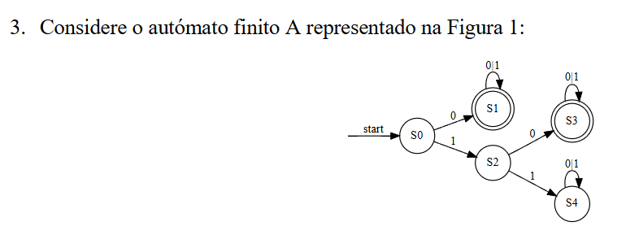

Sim. Vamos começar **do zero**, mas com o funcionamento real de um autómato, e depois aplicamos tudo à figura que enviaste.

## 1. O que é um autómato finito?

Um **autómato finito** é um modelo que recebe uma sequência de símbolos e vai mudando de **estado** à medida que lê esses símbolos.

No final responde essencialmente:

> **“Esta sequência é válida para mim?” → aceita ou rejeita.**

O PDF define um autómato finito através de um conjunto finito de **estados** e **transições entre esses estados**. 

“Finito” significa simplesmente que existe um **número limitado de estados**.

Na tua figura existem cinco:

```text
S0
S1
S2
S3
S4
```

Esses círculos são os **estados**.

---

## 2. O que é um estado?

Um **estado** representa a situação em que o autómato se encontra naquele momento.

Por exemplo, começa em:

```text
S0
```

Lê um símbolo e pode passar para:

```text
S1
```

Depois lê outro e pode ficar em `S1` ou mudar para outro estado, dependendo das regras.

O autómato só precisa de saber duas coisas:

```text
Em que estado estou?
Qual é o próximo símbolo que vou ler?
```

Com isso decide para onde vai a seguir.

---

## 3. O que são as setas?

As setas são as **transições**.

Na tua figura tens:

```text
S0 --0--> S1
```

Isto significa:

> Se estou em `S0` e leio um `0`, passo para `S1`.

Também tens:

```text
S0 --1--> S2
```

Significa:

> Se estou em `S0` e leio um `1`, passo para `S2`.

O PDF define precisamente uma transição como algo do género:

> estando no estado `x`, com a entrada `c`, transita-se para o estado `y`. 

---

## 4. O que é o alfabeto?

É o conjunto dos símbolos que o autómato sabe ler.

Na tua figura aparecem apenas:

```text
0
1
```

Logo o alfabeto é:

```text
Σ = {0,1}
```

Isto quer dizer que podemos dar ao autómato palavras como:

```text
0
1
00
01
101
11001
...
```

porque são formadas apenas por `0` e `1`.

---

## 5. O que significa a seta `start`?

Na tua figura:

```text
start → S0
```

significa:

> **S0 é o estado inicial.**

Antes de ler o primeiro símbolo, o autómato está sempre em `S0`.

O PDF também define explicitamente um **estado inicial**. 

---

## 6. E porque alguns círculos têm dois contornos?

Na tua figura:

```text
S1
S3
```

aparecem com **círculo duplo**.

Isso significa:

> são **estados finais**, também chamados **estados de aceitação**.

Isto é importantíssimo:

> Depois de ler **todos** os símbolos da palavra, se estivermos num estado final, a palavra é aceite.

Se terminarmos num estado que **não é final**, é rejeitada. O PDF explica exatamente esta regra de aceitação. 

Na tua figura:

```text
Estados finais = S1 e S3
```

Enquanto:

```text
S0
S2
S4
```

não são finais.

---

## 7. Vamos testar a palavra `0`

Começamos obrigatoriamente:

```text
S0
```

A palavra é:

```text
0
```

Lemos `0`.

A figura diz:

```text
S0 --0--> S1
```

Portanto:

```text
S0 → S1
     0
```

Acabou a palavra.

Estamos em:

```text
S1
```

`S1` é estado final.

**✅ A palavra `0` é aceite.**

---

## 8. Agora a palavra `1`

Começamos:

```text
S0
```

Lemos `1`:

```text
S0 --1--> S2
```

Acabou a palavra.

Estamos em `S2`.

Mas `S2` **não tem círculo duplo**.

**❌ A palavra `1` é rejeitada.**

É isto que significa “reconhecer uma palavra”.

---

## 9. Agora uma palavra maior: `101`

Começamos:

```text
S0
```

Primeiro símbolo:

```text
1
```

Logo:

```text
S0 --1--> S2
```

Ainda faltam:

```text
01
```

Agora estamos em `S2` e lemos `0`:

```text
S2 --0--> S3
```

Ainda falta:

```text
1
```

Em `S3`, a figura tem uma seta que volta ao próprio `S3` com:

```text
0|1
```

Isso significa:

> se chegar `0`, fico em `S3`;
> se chegar `1`, também fico em `S3`.

Portanto:

```text
S3 --1--> S3
```

Acabou a palavra.

Estamos em `S3`, que é final.

**✅ `101` é aceite.**

---

## 10. O que significa uma seta que volta ao mesmo círculo?

Por exemplo:

```text
      0|1
     ↻
    S1
```

Chama-se um **laço** (*self-loop*).

Significa que o autómato lê o símbolo mas **continua no mesmo estado**.

No teu `S1`:

```text
S1 --0--> S1
S1 --1--> S1
```

Portanto, depois de chegar a `S1`, qualquer quantidade de zeros e uns mantém o autómato em `S1`.

Por exemplo:

```text
0110101
```

começa:

```text
S0 --0--> S1
```

e depois:

```text
1 → continua S1
1 → continua S1
0 → continua S1
1 → continua S1
0 → continua S1
1 → continua S1
```

Termina em `S1`.

**✅ aceite.**

genui{"computing_formal_models_learning_block_staging":{"type_id":"FINITE_STATE_MACHINE","locale_override":"pt-PT"}}

## 11. Vamos agora ler toda a tua figura

Ela diz:

```text
S0:
0 → S1
1 → S2

S1:
0 → S1
1 → S1

S2:
0 → S3
1 → S4

S3:
0 → S3
1 → S3

S4:
0 → S4
1 → S4
```

E:

```text
Inicial: S0

Finais:
S1
S3
```

---

## 12. O que acontece se chegarmos a S4?

Olha para `S4`.

Não é estado final.

Além disso:

```text
S4 --0--> S4
S4 --1--> S4
```

Portanto, depois de chegar a `S4`, **nunca mais conseguimos sair dele**.

Por exemplo:

```text
110101
```

faz:

```text
S0 --1--> S2
S2 --1--> S4
S4 --0--> S4
S4 --1--> S4
S4 --0--> S4
S4 --1--> S4
```

Acabamos em `S4`.

**❌ rejeitada.**

Neste autómato, `S4` funciona como uma espécie de **estado de erro/rejeição permanente**.

---

## 13. Então que palavras este autómato aceita?

Vamos observar.

Se o primeiro símbolo for:

```text
0
```

fazemos:

```text
S0 → S1
```

e `S1` já é final. Depois qualquer `0` ou `1` mantém-nos em `S1`.

Portanto são aceites:

```text
0
00
01
000
011
010101
...
```

Ou seja:

> **todas as palavras que começam por `0`.**

Agora suponhamos que começam por:

```text
1
```

Vamos:

```text
S0 → S2
```

Ainda não estamos num estado final.

Se o segundo símbolo for:

```text
0
```

fazemos:

```text
S2 → S3
```

e `S3` é final.

Daí para a frente qualquer `0` ou `1` mantém-nos em `S3`.

Portanto:

```text
10
100
101
100101
101111
...
```

são aceites.

Mas se começar por:

```text
11
```

fazemos:

```text
S0 --1--> S2 --1--> S4
```

e ficamos presos em `S4`.

Logo:

```text
11
110
111
110101
...
```

são rejeitadas.

**Assim, olhando para a tua figura, conclui-se que o autómato aceita palavras binárias que começam por `0` ou começam por `10`.**

---

## 14. Como resolves qualquer exercício deste género?

Não tentes perceber o desenho inteiro de uma vez.

Faz sempre:

```text
1. Localizar START
2. Começar nesse estado
3. Ler o primeiro símbolo da palavra
4. Seguir a seta com esse símbolo
5. Ler o símbolo seguinte
6. Repetir
7. Quando acabarem os símbolos:
      círculo duplo → ACEITA
      círculo simples → REJEITA
```

Isto corresponde exatamente ao procedimento de validação apresentado no PDF. 

---

## 15. E o que significa AFD?

O autómato da tua figura é um **AFD**:

> **Autómato Finito Determinístico.**


A tua dúvida é exatamente esta: **“uma única escolha possível” não quer dizer que de um estado só possa sair uma seta no total.** Quer dizer que, **para o mesmo símbolo**, só pode haver **uma seta possível**.

No teu `S0` tens:

```text
S0 --0--> S1
S0 --1--> S2
```

Isto continua a ser determinístico, porque:

* se o símbolo lido for `0`, só há uma possibilidade: ir para `S1`;
* se o símbolo lido for `1`, só há uma possibilidade: ir para `S2`.

Ou seja, o autómato **não escolhe entre S1 e S2**. O símbolo recebido é que determina obrigatoriamente qual das duas transições seguir.

O PDF define AFD precisamente assim: em cada estado, **perante um símbolo**, só pode transitar para um único estado. 

O que faria deixar de ser determinístico seria, por exemplo:

```text
S0 --0--> S1
S0 --0--> S2
```

Aí sim, estando em `S0` e lendo `0`, haveria duas possibilidades:

```text
vou para S1?
ou
vou para S2?
```

Isso seria **não determinístico (AFN)**.

Portanto, compara:

```text
AFD ✅

S0:
0 → S1
1 → S2
```

com:

```text
AFN ❌ para determinismo

S0:
0 → S1
0 → S2
```

A regra que deves guardar é:

> **AFD = para cada par “estado atual + símbolo lido”, existe no máximo um próximo estado.**

No teu exemplo:

```text
(S0, 0) → S1
(S0, 1) → S2
```

Cada par tem uma única resposta. Por isso é determinístico.


---


A resposta correta é:

**iii. ✅ Um autómato finito determinístico (AFD) porque, em cada estado e perante cada símbolo do alfabeto, só pode transitar para um único estado.**

O alfabeto deste autómato é:

```text
{0, 1}
```

Agora verifica estado por estado:

```text
S0:  0 → S1     1 → S2
S1:  0 → S1     1 → S1
S2:  0 → S3     1 → S4
S3:  0 → S3     1 → S3
S4:  0 → S4     1 → S4
```

Repara: **nunca existe dúvida**. Por exemplo, estando em `S2`:

* se aparecer `0` → só pode ir para `S3`;
* se aparecer `1` → só pode ir para `S4`.

Isto é precisamente o que significa **determinístico**: para cada combinação **estado atual + símbolo lido**, existe um único próximo estado.

Se, por exemplo, existissem estas duas setas:

```text
S2 --0--> S3
S2 --0--> S4
```

aí, ao estar em `S2` e receber `0`, haveria **duas possibilidades**. Isso seria não determinismo (AFN).

Portanto:

**✅ iii) AFD.**
