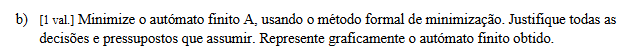
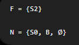

Sim. E este PDF explica exatamente o **método formal que o professor quer que uses**. Está nas páginas 50 a 59: dividir em finais/não finais, identificar grupos, comparar os grupos de destino, subdividir, repetir e finalmente fundir os estados equivalentes. 


# 1. O QUE SIGNIFICA MINIMIZAR UM AUTÓMATO?

Minimizar significa:

> **construir um autómato com menos estados, mas que aceite exatamente as mesmas palavras.**

Para isso procuramos estados que são **equivalentes**.

Dois estados são equivalentes quando:

> **não existe nenhuma continuação da palavra que consiga distinguir os dois.**

Por exemplo, se estando em `S1` e em `S3`, qualquer sequência futura de `0` e `1` leva sempre à aceitação nos dois casos, então não precisamos de ter dois estados diferentes.

Podemos juntá-los.

---

# 2. O AUTÓMATO ORIGINAL

Temos:

| Estado | com `0` vai para | com `1` vai para | Final? |
| ------ | ---------------- | ---------------- | ------ |
| S0     | S1               | S2               | Não    |
| S1     | S1               | S1               | Sim    |
| S2     | S3               | S4               | Não    |
| S3     | S3               | S3               | Sim    |
| S4     | S4               | S4               | Não    |

Estados finais:

```text
S1, S3
```

Estados não finais:

```text
S0, S2, S4
```

---

# 3. PRIMEIRO PASSO: SEPARAR FINAIS DOS NÃO FINAIS

Começamos com dois grupos:

```text
Grupo N = {S0, S2, S4}   não finais

Grupo F = {S1, S3}       finais
```

---

# 4. AGORA ANALISAMOS O GRUPO S0,S2,S4

## 1. S0

As transições são:

```text
S0 --0--> S1
S0 --1--> S2
```


```text
S0 = (S1, S2) = (F,N)
```


---

## 2. S2

Temos:

```text
S2 --0--> S3
S2 --1--> S4
```
Logo:

```text
S2 = (F,N)
```

Até aqui:

```text
S0 = (F,N)
S2 = (F,N)
```

São iguais.

Por enquanto, **não conseguimos distingui-los**.

Portanto continuam juntos.


---

## 3. S4

Temos:

```text
S4 --0--> S4
S4 --1--> S4
```

```text
S4 = (N,N)
```

Agora compara:

```text
S0 = (F,N)
S2 = (F,N)

S4 = (N,N)
```

`S4` comporta-se de maneira diferente, LOGO, **separamos**


Vamos dar-lhes nomes NOVOS para não criar confusão:

```text
X = {S0,S2}
Y = {S4}
Z = {S1,S3}
```

---

# 8. PORQUE NÃO TERMINAMOS AQUI?

Porque o antigo grupo `N` foi dividido:

```text
N
↓
X = {S0,S2}
Y = {S4}
```

Agora sabemos mais.

Portanto temos de voltar a verificar `S0` e `S2` usando **os novos grupos**.

Este é o coração da minimização:

> **sempre que dividimos um grupo, voltamos a verificar os grupos que ainda têm vários estados.**

---

# 9. SEGUNDA ANÁLISE DE S0 E S2

Agora os grupos são:

```text
X = {S0,S2}
Y = {S4}
Z = {S1,S3}
```

## 1. `S0`.


```text
S0 = (Z,X)
```

---

## 2. `S2`:

```text
S2 = (Z,Y)
```

Agora compara:

```text
S0 = (Z,X)

S2 = (Z,Y)
```

São diferentes.

Logo:

```text
S0 ≠ S2
```

e temos de os separar.

---

# 11. AGORA OS GRUPOS SÃO


Estados que estão sozinhos já não podem ser divididos mais:

```text
{S0}
{S2}
{S4}
```

Só temos de verificar:

```text
{S1,S3}
```

---

# 12. VERIFICAMOS S1 E S3

```text
S1 = (Z,Z)

S3 = (Z,Z)
```

São iguais.

Portanto:

```text
S1 ≡ S3
```

São realmente equivalentes.

---

# 13. QUANDO SABEMOS QUE ACABOU?

Quando fazemos uma ronda completa e **já não conseguimos dividir nenhum grupo**.

Chegámos a:

```text
{S0}

{S2}

{S4}

{S1,S3}
```

O único grupo com dois estados é:

```text
{S1,S3}
```

e verificámos que não pode ser dividido.

Então o processo terminou.

---

# 14. O QUE FAZEMOS COM {S1,S3}?

Como são equivalentes, transformamo-los num único estado.

Podemos chamar-lhe:

```text
S13
```

onde:

```text
S13 = {S1,S3}
```

E como tanto `S1` como `S3` eram finais:

```text
S13 é final
```

---

# 15. CONSTRUIR O AUTÓMATO MINIMIZADO

Agora temos quatro estados:

```text
S0
S2
S4
S13
```

Vamos reconstruir as transições.

# 16. RESULTADO FINAL

| Estado | `0` | `1` |         |
| ------ | --- | --- | ------- |
| → S0   | S13 | S2  | inicial |
| S2     | S13 | S4  |         |
| *S13   | S13 | S13 | final   |
| S4     | S4  | S4  |         |


# CRITÉRIOS DE MINIMIZAÇÃO


## 1. S_n = (N,F) E (F,N) SÃO DIFERENTES 

Não. Nesse caso já seriam diferentes.

Se tivesses:

```text
S0 = (F,N)
S2 = (N,F)
```

isso significa:

```text
S0:
0 -> F
1 -> N
```

e:

```text
S2:
0 -> N
1 -> F
```

```text
(F,N) ≠ (N,F)
```

Logo `S0` e `S2` teriam de ser separados logo nessa ronda.

A ideia é esta:

```text
S0 = (F,N)
S2 = (F,N)
```

---

## 2. MESMO QUE UM ESTADO FINAL SEJA IGUAL A UM ESTADO NÃO FINAL, NÃO SE JUNTAM.

Não. **Um estado final e um estado não final nunca podem ser fundidos**, mesmo que tenham exatamente o mesmo comportamento nas transições.

Por exemplo:

```text
S0 = não final
S1 = final
```

e ambos tenham:

```text
S0 = (X,Y)
S1 = (X,Y)
```

Mesmo assim:

```text
S0 ≠ S1
```


---


## 3. AUTÓMATOS NÃO DETERMINÍSTICOS 

Para aplicar o **método formal de minimização de AFD**, primeiro temos de o transformar em AFD.


---


## 4. O Conjunto vazio Ø É UM ESTADO NÃO FINAL, LOGO FICA NO GRUPO NÃO FINAL QUANDO MINIMIZAMOS


