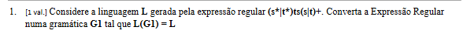

# O que significa gramatica G1 tal que L(G1) = L

Quer dizer simplesmente:

> **Construir uma gramática chamada `G1` cuja linguagem gerada seja exatamente a linguagem `L`.**

Por partes:

```text
G1
```

= nome da gramática que vais construir.

```text
L(G1)
```

= linguagem gerada pela gramática `G1`, ou seja, **todas as palavras que essa gramática consegue produzir**.

```text
L
```

= a linguagem que o enunciado já definiu pela expressão regular.

Então:

```text
L(G1) = L
```

significa:

> **As palavras geradas por G1 têm de ser exatamente as mesmas palavras permitidas pela expressão regular.**

No teu exercício:

```text
L = linguagem da expressão regular (s*|t*)ts(s|t)+
```

Pedem uma gramática `G1` tal que:

```text
L(G1) = L
```

Ou seja:

```text
Expressão regular
(s*|t*)ts(s|t)+
        ↓
define certas palavras

Gramática G1
        ↓
tem de gerar exatamente essas mesmas palavras
```

Nem pode gerar palavras a mais, nem pode deixar de gerar palavras que a expressão regular aceita.

O PDF usa precisamente `L(G)` para representar **a linguagem gerada por uma gramática G**. 


# Antes, o que é uma gramatica regular (tipo 3)
Uma **gramática regular (tipo 3)** é um tipo de gramática muito simples, usado para gerar **linguagens regulares** — as mesmas linguagens que também podem ser descritas por **expressões regulares** e reconhecidas por **autómatos finitos**.

No teu PDF, as gramáticas tipo 3 são definidas assim: 

```text
A → a
A → aB
A → ε
```

onde:

* `A` e `B` são **não terminais**
* `a` é um **terminal**
* `ε` é a palavra vazia

Por exemplo:

```text
S → aA
A → bA
A → ε
```

Aqui:

```text
S, A
```

são não terminais.

E:

```text
a, b
```

são terminais.

A derivação pode ser:

```text
S
→ aA
→ abA
→ abbA
→ abb
```

porque no fim fazemos:

```text
A → ε
```

Logo esta gramática pode gerar:

```text
a
ab
abb
abbb
...
```

que corresponde à expressão regular:

```text
ab*
```


# Resolucao do exercicio

Sim. A expressão do exercício é:

```text
(s* | t*) t s (s | t)+
```


Sim. O que faltou na explicação anterior foi **um método que possas repetir noutros exercícios**. Eu estava praticamente a “inventar” `A`, `B`, `C`, etc., sem te mostrar de onde vinham.

Os teus PDFs dão precisamente as duas peças necessárias:

1. **Expressão regular → autómato finito**: o PDF diz que dada uma expressão regular é sempre possível construir um AFN que aceite exatamente a mesma linguagem. 
2. **Autómato → gramática**: o PDF de Gramáticas ensina a criar **um não terminal por cada estado**, uma produção por cada transição e `ε` para estados finais. 

Portanto, para aprenderes sem andar a adivinhar regras, usa sempre:

```text
EXPRESSÃO REGULAR
       ↓
     AUTÓMATO
       ↓
     GRAMÁTICA
```

Vamos fazê-lo com:

```text
(s* | t*) t s (s | t)+
```

## 1. Primeiro traduzimos a expressão para etapas

A expressão diz:

```text
(s* | t*)      t      s      (s | t)+
    ↑          ↑      ↑          ↑
   parte 1   obrigatório obrigatório parte final
```

Ou seja:

* primeiro: zero ou mais `s` **OU** zero ou mais `t`;
* depois: obrigatoriamente `t`;
* depois: obrigatoriamente `s`;
* finalmente: pelo menos um `s` ou `t`.

Agora vamos criar estados que representem **em que parte da expressão estamos**.

---

## 2. Ramo `s*`

Começamos no estado `S`.

Se decidirmos usar `s*`, podemos consumir `s`:

```text
S --s--> A
```

E como `*` permite vários `s`:

```text
A --s--> A
```

Portanto:

```text
S --s--> A --s--> A --s--> A ...
```

Isto permite:

```text
s
ss
sss
...
```

Mas lembra-te: `s*` também permite **zero `s`**. Portanto não somos obrigados a passar por `A`.

---

## 3. Depois vem o `t` obrigatório

Depois dos `s` iniciais, tem de aparecer:

```text
t
```

Logo:

```text
A --t--> B
```

Por exemplo:

```text
sss
```

mais o `t` obrigatório:

```text
S --s--> A --s--> A --s--> A --t--> B
```

Consumimos:

```text
ssst
```

Mas se `s*` tiver **zero `s`**, podemos consumir logo o `t` obrigatório:

```text
S --t--> B
```

Isto é precisamente o caso que perguntaste antes.

---

## 4. E o ramo `t*`?

Também podemos escolher:

```text
t*
```

Criamos um estado `T`:

```text
S --t--> T
T --t--> T
```

Assim podemos consumir:

```text
t
tt
ttt
...
```

Quando decidimos que terminámos o `t*`, ainda precisamos de consumir **o `t` obrigatório que vem depois**:

```text
T --t--> B
```

Portanto:

```text
S --t--> T --t--> T --t--> B
```

poderia representar:

```text
tt      ← t*
+
t       ← t obrigatório
=
ttt
```

### Repara numa coisa importante

A partir de `S`, com um `t`, temos duas possibilidades:

```text
S --t--> T
```

ou:

```text
S --t--> B
```

Porquê?

Porque aquele primeiro `t` pode ser interpretado como:

* um `t` pertencente ao `t*`; **ou**
* o `t` obrigatório, caso `t*` tenha zero ocorrências.

É por isso que este autómato pode ser **não determinístico (AFN)**. E isso não é problema.

---

## 5. Agora o `s` obrigatório

Já chegámos ao estado `B` depois de consumir o `t` obrigatório.

A expressão exige agora:

```text
s
```

Portanto:

```text
B --s--> C
```

Agora já consumimos obrigatoriamente:

```text
...ts
```

---

## 6. Finalmente `(s|t)+`

O `+` significa:

> **pelo menos uma ocorrência.**

Portanto, a partir de `C`, temos obrigatoriamente de consumir `s` ou `t`:

```text
C --s--> D
C --t--> D
```

Agora que já consumimos pelo menos um, `D` pode ser final.

Mas podem existir mais:

```text
D --s--> D
D --t--> D
```

Então `D` é o **estado final**.

---

## 7. O autómato que construímos

As transições ficaram:

```text
S --s--> A
A --s--> A
A --t--> B

S --t--> B

S --t--> T
T --t--> T
T --t--> B

B --s--> C

C --s--> D
C --t--> D

D --s--> D
D --t--> D
```

e:

```text
D = estado final
```

Agora é que aparece a parte bonita: **converter isto numa gramática é quase mecânico**.

---

# 8. Regra do PDF: transição → produção

O PDF ensina:

> Para cada estado, criar um não terminal. Para cada transição, criar uma alternativa na produção. Estados finais podem produzir `ε`. 

Portanto:

```text
transição:

A --s--> B
```

vira:

```text
A → sB
```

É só isto.

---

## 9. Aplicamos às nossas transições

Temos:

```text
S --s--> A
```

vira:

```text
S → sA
```

Temos:

```text
S --t--> B
S --t--> T
```

vira:

```text
S → tB | tT
```

Logo:

```text
S → sA | tB | tT
```

Depois:

```text
A --s--> A
A --t--> B
```

vira:

```text
A → sA | tB
```

Depois:

```text
T --t--> T
T --t--> B
```

vira:

```text
T → tT | tB
```

Depois:

```text
B --s--> C
```

vira:

```text
B → sC
```

Depois:

```text
C --s--> D
C --t--> D
```

vira:

```text
C → sD | tD
```

Finalmente:

```text
D --s--> D
D --t--> D
```

vira:

```text
D → sD | tD
```

Mas `D` é final. O PDF diz que um estado final recebe:

```text
D → ε
```

Portanto:

```text
D → sD | tD | ε
```

---

# 10. E agora percebes de onde veio a gramática

Não foi:

> “Vou inventar um `A`, depois talvez um `B`...”

Foi:

```text
EXPRESSÃO REGULAR
       ↓
criamos estados para acompanhar
em que parte da expressão estamos
       ↓
cada estado torna-se um NÃO TERMINAL
       ↓
cada seta torna-se uma PRODUÇÃO
```

Resultado:

```text
S → sA | tB | tT
A → sA | tB
T → tT | tB
B → sC
C → sD | tD
D → sD | tD | ε
```

## O método para qualquer exercício

Guarda sobretudo isto:

```text
1. Converter a expressão regular num autómato.

2. Dar um não terminal a cada estado.

3. Se existir:
      X --a--> Y
   escrever:
      X → aY

4. Se X for estado final:
      X → ε

5. O estado inicial do autómato
   é o símbolo inicial da gramática.
```

E isto **não é um método que estou a inventar**: o teu PDF mostra exatamente a conversão **autómato → gramática** desta maneira.  O outro PDF confirma a equivalência entre expressões regulares e autómatos finitos. 

Portanto, para alguém que está a aprender, **ER → autómato → gramática é muito mais seguro e compreensível do que tentar passar diretamente da expressão regular para produções**.


Fica assim, completa:

G1 = (V, Σ, P, S)

Para a expressão regular:

(s* | t*)ts(s | t)+

temos:

### 1. V — conjunto dos não terminais

São as letras maiúsculas que usamos para controlar a construção da palavra:

V = {S, A, T, B, C, D}

Ou seja:

* S, A, T, B, C e D são não terminais.
* Eles servem para indicar em que parte da construção da palavra estamos.
* No final da derivação, estes símbolos desaparecem e ficam apenas os terminais s e t.

### 2. Σ — alfabeto, ou seja, os terminais

São os símbolos que podem aparecer nas palavras finais da linguagem:

Σ = {s, t}

Portanto, as palavras geradas pela gramática são constituídas apenas por s e t.

Por exemplo:

tss

sstst

ttsts

podem ser palavras da linguagem, dependendo das regras.

### 3. P — conjunto das produções ou regras

As produções são:

P = {

S -> sA | tB | tT

A -> sA | tB

T -> tT | tB

B -> sC

C -> sD | tD

D -> sD | tD | ε

}

Cada linha diz o que um não terminal pode produzir.

Por exemplo:

S -> sA | tB | tT

significa que, quando temos S, podemos escolher uma destas três possibilidades:

S -> sA

ou

S -> tB

ou

S -> tT

Outro exemplo:

A -> sA | tB

significa que A pode:

* produzir mais um s e continuar em A;
* ou produzir t e passar para B.

E:

D -> sD | tD | ε

significa que D pode:

* produzir s e continuar;
* produzir t e continuar;
* ou produzir ε e terminar.

ε significa palavra vazia, ou seja, não acrescenta nenhum símbolo à palavra.

### 4. S — símbolo inicial

O símbolo inicial é:

S

Isto significa que qualquer derivação começa sempre em S.

Por exemplo:

S
-> sA
-> ssA
-> sstB
-> sstsC
-> sststD
-> sstst

No último passo foi utilizada a regra:

D -> ε

e, por isso, D desapareceu.

A palavra final é:

sstst

---

Portanto, a gramática completa é:

G1 = ({S, A, T, B, C, D}, {s, t}, P, S)

onde:

P = {

S -> sA | tB | tT

A -> sA | tB

T -> tT | tB

B -> sC

C -> sD | tD

D -> sD | tD | ε

}

Assim, temos os quatro elementos da gramática:

V = {S, A, T, B, C, D}

Σ = {s, t}

P = conjunto das regras acima

S = símbolo inicial

Uma coisa importante: escreve-se normalmente:

G = (V, Σ, P, S)

com parênteses.

Isto porque uma gramática é apresentada como um conjunto organizado de quatro componentes: V, Σ, P e S.

Portanto, não escrevemos:

G = {V, Σ, P, S}

mas sim:

G = (V, Σ, P, S)

No teu exercício, a forma final é:

G1 = ({S, A, T, B, C, D}, {s, t}, P, S)

com:

P = {
S -> sA | tB | tT;
A -> sA | tB;
T -> tT | tB;
B -> sC;
C -> sD | tD;
D -> sD | tD | ε
}
