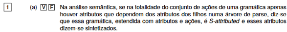
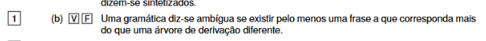
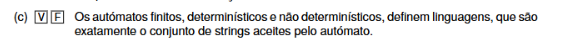
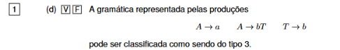
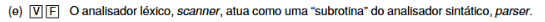
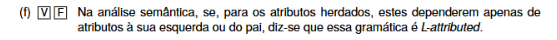
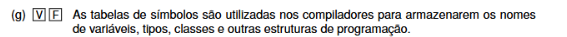
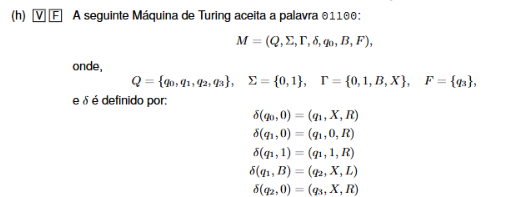
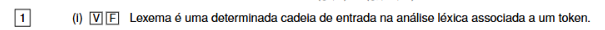
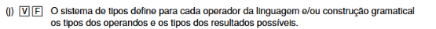

a)  
**Verdadeiro**

---

b)  
**Verdadeiro**

---

c) 

### Qual é a diferença entre frase e palavra

Por exemplo, se:

```text
S -> aSb | ε
```

podemos gerar:

```text
ab
aabb
aaabbb
```

Cada uma destas é uma **palavra** da linguagem e também pode ser chamada **frase** da linguagem.


Sim, **Verdadeiro**. ✅

A frase diz que os autómatos finitos, tanto **determinísticos (AFD)** como **não determinísticos (AFND)**, definem linguagens, e que essa linguagem é:

> o conjunto de todas as strings/palavras que o autómato aceita.

Ou seja:

```text
L(A) = { w | o autómato A aceita w }
```

E isso vale tanto para AFD como para AFND.

Portanto:

```text
V ✅
```

E lembra-te: **AFD e AFND têm o mesmo poder de expressão** — ambos reconhecem exatamente as linguagens regulares.

---

d)



Sim, **Verdadeiro**. ✅

As produções são:

```text
A -> a
A -> bT
T -> b
```

Uma gramática de **tipo 3 (regular)** pode ter produções da forma:

```text
A -> a
A -> aB
```

ou seja:

* à esquerda: **um único não terminal**
* à direita: **um terminal**, ou **um terminal seguido de um não terminal**

Aqui:

```text
A -> a    ✅
A -> bT   ✅
T -> b    ✅
```

Todas respeitam a forma de uma gramática regular à direita.

Logo:

```text
V ✅
```

E, sendo tipo 3, também pertence naturalmente às classes superiores da hierarquia, mas a classificação mais restritiva é **tipo 3**.


---


e) 

Sim, **Verdadeiro**. ✅

A ideia é esta:

```text
parser
  ↓ pede o próximo token
scanner
  ↓ devolve o token
parser continua
```

O **scanner/analisador léxico** lê os caracteres do programa e transforma-os em **tokens**. O **parser/analisador sintático** vai pedindo esses tokens ao scanner para verificar se a sequência respeita a gramática.

Por isso, dizer que o scanner atua como uma **subrotina** do parser está correto.

```text
V ✅
```

Exemplo:

```text
x = 25;
```

O scanner devolve algo como:

```text
IDENTIFICADOR
ATRIBUIÇÃO
NÚMERO
PONTO_E_VÍRGULA
```

e o parser usa esses tokens para verificar a estrutura sintática.


---

f)



Continua a ser **Verdadeiro**.

A tua dúvida é legítima, mas o ponto está nesta parte da frase:

> **“para os atributos herdados, se estes dependem apenas…”**

Ou seja, a afirmação não diz que uma gramática L-attributed **só tem atributos herdados**. Diz apenas qual é a restrição aplicada **aos atributos herdados**.

Uma gramática L-attributed pode ter:

* atributos **sintetizados**;
* atributos **herdados**.

A condição é que, para cada atributo herdado, ele só dependa de informação do **pai** e de símbolos que estejam **à esquerda**.

Exemplo:

```text
A -> B C
```

Podes ter:

```text
C.inh = A.inh + B.syn
```

Aqui `C.inh` é herdado e depende de:

```text
A.inh   -> pai
B.syn   -> símbolo à esquerda
```

Isto é permitido numa gramática L-attributed.

E ao mesmo tempo podes ter um atributo sintetizado:

```text
A.syn = C.syn
```

Isso não impede a gramática de ser L-attributed.

Portanto, a regra correta é:

```text
S-attributed:
todos os atributos são sintetizados

L-attributed:
pode ter sintetizados e herdados,
mas os herdados só podem depender do pai
e de símbolos à esquerda
```

Logo, a afirmação da pergunta é:

**Verdadeiro ✅**


---

g) 

Sim, **Verdadeiro**. ✅

As **tabelas de símbolos** são usadas pelo compilador para guardar informação sobre identificadores do programa, como:

* nomes de variáveis;
* tipos;
* funções;
* classes;
* âmbito/scope;
* outras informações associadas.

Portanto, a afirmação:

> “As tabelas de símbolos são utilizadas nos compiladores para armazenarem os nomes de variáveis, tipos, classes e outras estruturas de programação.”

está correta.

```text
(g) V ✅
```


---

h) 

Sim, correto — a palavra `01100` é aceite. ✅

Seguindo as transições da máquina:

```text
01100
```

1. `q0` lê o primeiro `0`:

```text
δ(q0,0) = (q1,X,R)
```

fica:

```text
X1100
```

e passa para `q1`.

2. Em `q1`, os símbolos `1`, `1`, `0`, `0` são apenas percorridos para a direita:

```text
δ(q1,1) = (q1,1,R)
δ(q1,0) = (q1,0,R)
```

Chega ao branco `B`.

3. Em `B`:

```text
δ(q1,B) = (q2,X,L)
```

fica:

```text
X1100X
```

e volta uma posição para a esquerda, ficando sobre o último `0`.

4. Agora:

```text
δ(q2,0) = (q3,X,R)
```

Esse último `0` é substituído por `X`:

```text
X110XX
```

e a máquina chega a:

```text
q3
```

Como:

```text
F = {q3}
```

`q3` é estado final.

Portanto:

```text
01100 ✅ aceite
```

E sim, a fita fica exatamente:

```text
X110XX
```

quando entra em `q3`.


---


i) 

Sim, **Verdadeiro**. ✅

Um **lexema** é a sequência concreta de caracteres encontrada no código-fonte e que corresponde a um **token**.

Exemplo:

```text
x = 25;
```

Pode dar:

```text
Lexema: x    -> Token: IDENTIFICADOR
Lexema: =    -> Token: ATRIBUIÇÃO
Lexema: 25   -> Token: NÚMERO
Lexema: ;    -> Token: PONTO_E_VÍRGULA
```

Portanto a frase:

> “Lexema é uma determinada cadeia de entrada na análise léxica associada a um token.”

está correta.

```text
(i) V ✅
```


---

j) 


Sim, **Verdadeiro**. ✅

A afirmação está correta porque o **sistema de tipos** define, para cada operador ou construção da linguagem, quais combinações de tipos são permitidas e qual pode ser o tipo do resultado.

Exemplo:

```text
int + int -> int
```

ou, dependendo da linguagem:

```text
int + float -> float
```

Mas algo como:

```text
int + string
```

pode ser inválido, salvo se a linguagem definir essa operação.

Portanto:

```text
(j) V ✅
```

A ideia-chave é:

> sistema de tipos = regras sobre os tipos dos operandos e os tipos dos resultados possíveis.


