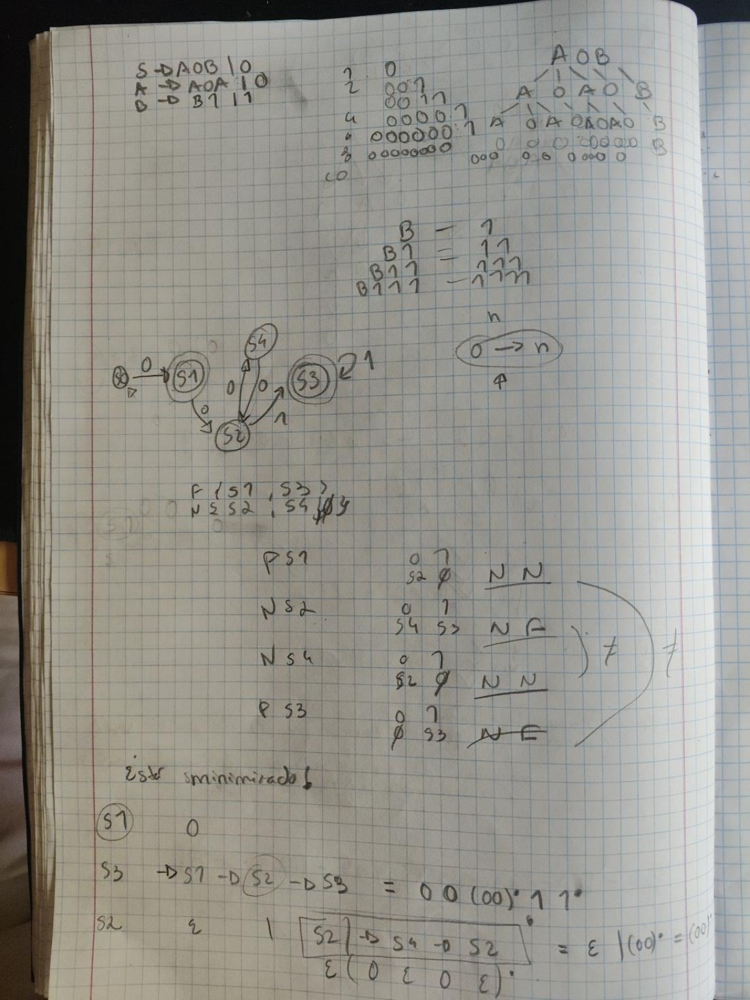
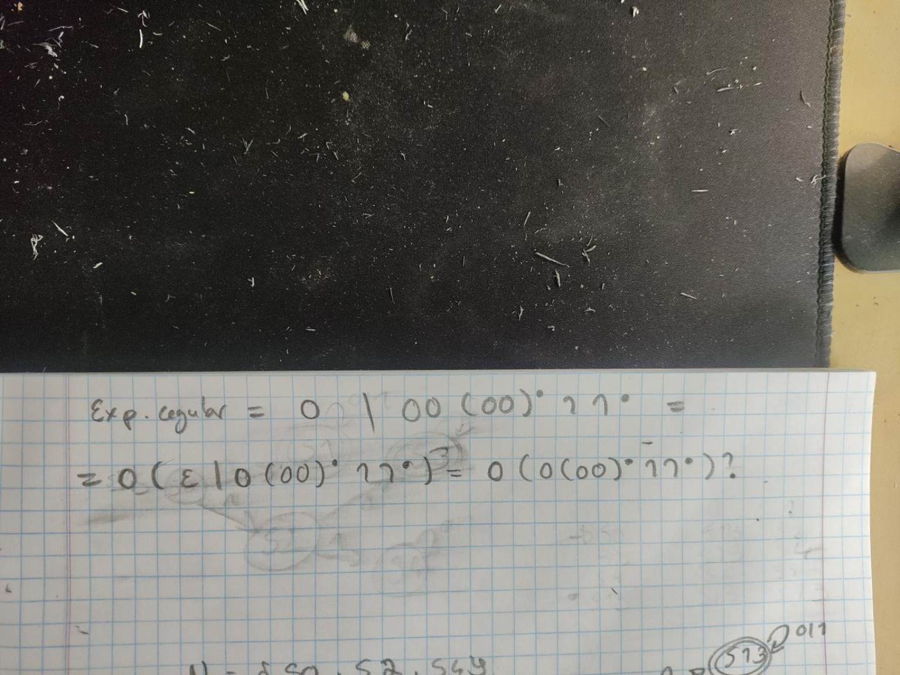

# Gerar uma linguagem/autómato/expressão regular a partir de uma gramática

### 1. Se a gramática é Tipo 3 (regular)

Não precisas primeiro de descobrir a linguagem. Podes converter **diretamente**:

```text
A → 0B    =>    A --0--> B
A → 1     =>    A --1--> F
A → ε     =>    A é final
```

Este é o método formal.

### 2. Se a gramática NÃO permite conversão direta

Aí sim, fazes o que disseste:

```text
1. Perceber o que cada não terminal gera
2. Decompor as palavras
3. Descobrir o padrão da linguagem
4. Escrever uma expressão regular
5. A partir da expressão/padrão, construir o autómato
```

Por exemplo, no exercício anterior:

```text
A → A0A | 0
```

percebemos:

```text
A gera 0, 000, 00000, ...
= número ímpar de 0
```

Depois:

```text
B → B1 | 1
```

gera:

```text
1, 11, 111, ...
= 1+
```

e daí descobrimos a linguagem completa.

### Regra que podes guardar

```text
Gramática regular (Tipo 3)
→ conversão formal direta para AF

Gramática não regular
→ tentar perceber/decompor a linguagem
→ se essa linguagem for regular, construir uma ER/AF equivalente
```

Portanto, **sim: decompor o que cada não terminal consegue gerar é uma excelente técnica para descobrir a linguagem e daí chegar à expressão regular ou ao autómato.**


## 4.d)






Expressão reular obtida: ````0 (0 (00) * 11 *)? ````