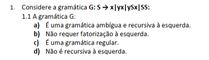

# Fatorização à esquerda

**Fatorização à esquerda** significa retirar um prefixo comum de duas ou mais produções do mesmo não terminal.

A tua gramática é:

```text
S -> x | yx | ySx | SS
```

Olha para estas duas produções:

```text
S -> yx
S -> ySx
```

As duas começam pelo mesmo símbolo:

```text
y
```

Portanto existe um **prefixo comum à esquerda**. É isso que nos diz que a gramática **requer fatorização à esquerda**.

Fatorizamos assim:

```text
S -> x | yA | SS
A -> x | Sx
```

Porque:

```text
yx   = y + x
ySx  = y + Sx
```

Logo retiramos o `y` comum:

```text
y(x | Sx)
```

### Regra para detetar rapidamente

Sempre que tiveres algo do género:

```text
A -> αβ | αγ
```

em que as duas alternativas começam pelo mesmo `α`, precisas de fatorizar:

```text
A -> αB
B -> β | γ
```

No teu exercício:

```text
yx
ySx
↑
prefixo comum = y
```

Portanto, **sim, esta gramática requer fatorização à esquerda**.

E atenção: também tens:

```text
S -> SS
```

que começa pelo próprio `S`, logo a gramática tem **recursividade à esquerda imediata**.


## O prefixo tem de ser terminal ou não

Não, **não interessa se o prefixo comum é terminal ou não terminal**.

Na fatorização à esquerda, o que interessa é apenas isto:

> duas ou mais alternativas do mesmo não terminal começam exatamente pela mesma sequência de símbolos.

Essa sequência comum pode conter:

* só terminais;
* só não terminais;
* uma mistura dos dois.

Exemplos:

```text
A -> aB | aC
```

prefixo comum:

```text
a
```

terminal.

Outro:

```text
A -> BCd | BCe
```

prefixo comum:

```text
BC
```

não terminais.


---


As respostas são:

**1.1 → a)** É uma gramática **ambígua e recursiva à esquerda**.

* Recursão à esquerda por `S -> SS`.
* É ambígua porque é possível obter a mesma palavra por árvores de derivação diferentes.
* Além disso, `yx` e `ySx` têm prefixo comum `y`, portanto a opção b) é falsa.

**1.2 → b)** É uma gramática **independente do contexto (Tipo 2)**.

* Todas as produções têm apenas um não terminal à esquerda.
* Não é LL(1), nem preditiva, nem adequada diretamente a descida recursiva, devido sobretudo à recursão à esquerda `S -> SS`.

**2 → d)** Todas as anteriores. ✅
A tabela de símbolos guarda informação sobre identificadores, é usada ao longo do compilador e regista também o scope/âmbito.

**3 → b)** Representação intermédia. ✅
A otimização **independente da máquina** é normalmente feita sobre o código/representação intermédia, antes da geração do código específico da máquina.

**4 → b)** Se for possível construir pelo menos **duas árvores de derivação diferentes para a mesma frase**. ✅

Portanto:

```text
1.1 → a
1.2 → b
2   → d
3   → b
4   → b
```

Atenção à **4(a)**: duas sequências de derivação diferentes, por si só, não garantem ambiguidade; podem corresponder à mesma árvore. O critério seguro é **duas árvores diferentes para a mesma frase**.
