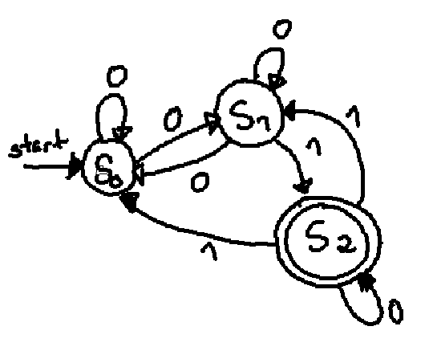
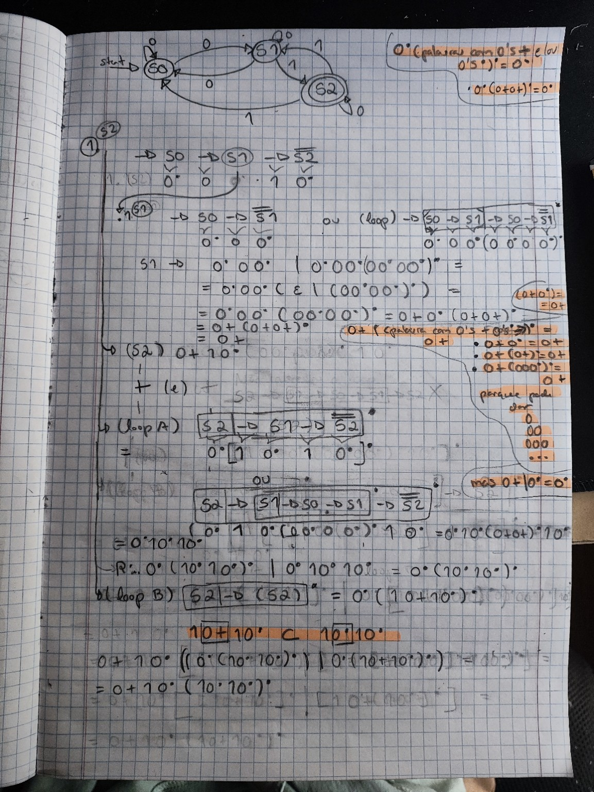
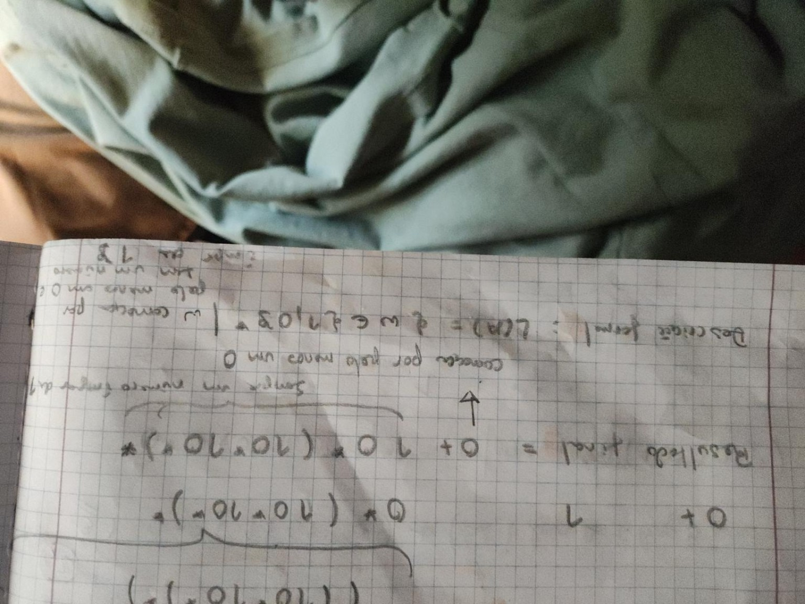

# 1.

^(202[0-9])-(0[1-9]|1[0-2])-[0-9]{2} [0-9]{2}:[0-9]{2}:[0-9]{2}\|MCH:[A-Za-z0-9]{3,5}\|OP:[0-9]{5}\|EVT:(START|STOP|ERROR)(\|ERR:E[0-9]{2})?$


# 2.

## a)


## b)
É um AFND (Autómato Finito Não Determinístico), porque existe pelo menos um estado que, para o mesmo símbolo do alfabeto, possui mais do que um estado de destino.

## c) 
Primeiro converti o autómato em expressão regular (ver)

# Expressão regular para linguagem 



## Resposta 



## d) 
Convertemos o AFND em AFD para minimizá-lo e

A tabela passou a ser:

| Estado | 0    | 1    |
| ------ | ---- | ---- |
| `S0`   | `B`  | `∅`  |
| `B`    | `B`  | `S2` |
| `S2`   | `S2` | `B`  |
| `∅`    | `∅`  | `∅`  |

Estado final: `S2`.

### 1. Separar finais de não finais

Começas sempre por aqui:

```text
F = {S2}

N = {S0, B, ∅}
```

Resultado:

```text
{S0}   {B}   {S2}   {∅}
```

Já estão todos separados, portanto **não há estados para juntar**.

✅ O teu AFD já é mínimo e continua com os 4 estados:

```text
S0, B, S2, ∅
```
