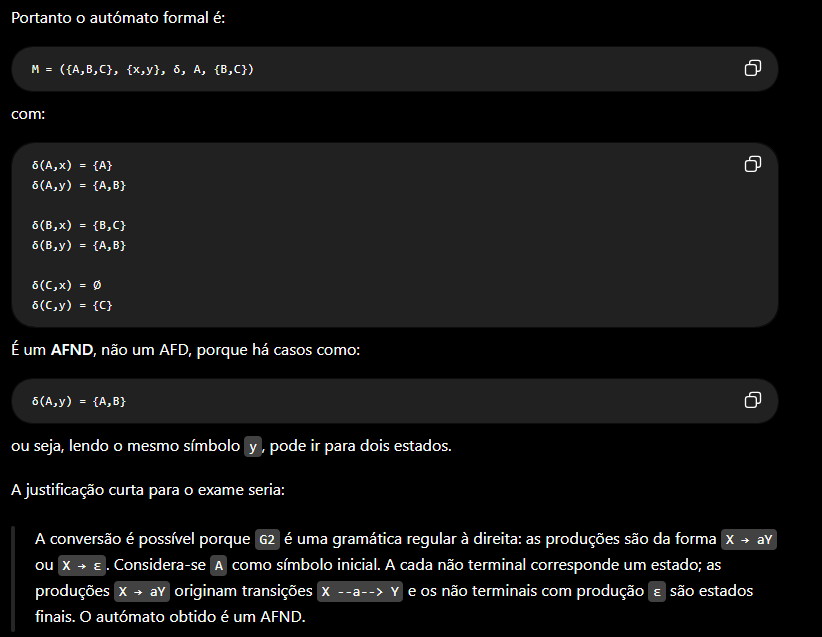

# 1

## a)

G1 = (
{S,B,D,E,F},
{u,v,w,x,y,z},
P,
S
)


## b)

A gramática `G1` é **Tipo 2 — Gramática Livre de Contexto**.

A razão é que em todas as produções, o lado esquerdo tem **exatamente um símbolo não terminal**:

```text
S -> uBDz
B -> Bv | w
D -> EF
E -> y | ε
F -> x | ε
```

Isto respeita a forma geral das gramáticas Tipo 2:

```text
A -> α
```

em que `A` é um único não terminal e `α` pode ser uma sequência de terminais e/ou não terminais.

Não é Tipo 3 (regular), porque aparecem produções como:

```text
S -> uBDz
D -> EF
```

que têm **mais de um não terminal no lado direito**.

Portanto:

```text
G1 é uma gramática de Tipo 2 (Livre de Contexto).
```

Uma justificação boa para colocar no exame seria:

> **G1 é Tipo 2, pois todas as produções possuem apenas um não terminal no lado esquerdo. Não é Tipo 3 porque existem produções, como `S -> uBDz` e `D -> EF`, com mais de um não terminal no lado direito.**
---

## d) 


# Simplificar a gramática


## 1. Eliminar recursividade à esquerda

Existe recursividade à esquerda quando tens:

```text
A → Aα | β
```

porque `A` volta imediatamente a aparecer à esquerda.

A transformação é:

```text
A  → βA'
A' → αA' | ε
```

Exemplo:

```text
A → Aa | b
```

passa para:

```text
A  → bA'
A' → aA' | ε
```

---

## 2. Eliminar produções vazias

Uma produção vazia é:

```text
A → ε
```

A regra importante é:

> Se `A` pode desaparecer e aparece numa produção, temos de criar também a versão dessa produção **sem A**, antes de retirar `A → ε`.

Exemplo:

```text
S → aAb
A → c | ε
```

Como `A` pode desaparecer:

```text
S → aAb | ab
A → c
```

Exemplo:
```text
D → EF
E → y | ε
F → x | ε
```
por:

```
D → yx | y | x | ε
```

E já podemos eliminar E e F.

Isto é exatamente o que acontece no teu exercício.

---

## 3. Produções em cadeia

Uma produção em cadeia é uma produção do género:

```text
A → B
```

Um não terminal produz **apenas outro não terminal**.

Exemplo:

```text
A → B
B → x | y
```

Não precisamos desse intermediário. Podemos fazer:

```text
A → x | y
```

e retirar:

```text
A → B
```

Atenção:

```text
D → EF
```

**não é uma produção em cadeia**, porque tem dois não terminais.

Mas:

```text
D → E
D → F
```

são produções em cadeia.

---


# 2.a)

