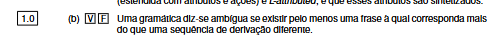

A afirmação é **Falsa**. O teu PDF define uma gramática ambígua assim:

> existe pelo menos uma frase que pode ser obtida através de **duas árvores de derivação distintas**. 

A frase da pergunta fala apenas em:

> “mais do que uma **sequência de derivação** diferente”

E isso, sozinho, **não basta para provar ambiguidade**.

### Exemplo muito simples

Gramática:

```text
S -> AB
A -> a
B -> b
```

Queremos gerar:

```text
ab
```

Podemos fazer primeiro `A`:

```text
S
=> AB
=> aB
=> ab
```

Ou podemos fazer primeiro `B`:

```text
S
=> AB
=> Ab
=> ab
```

Temos **duas sequências de derivação diferentes**.

Mas ambas correspondem à **mesma árvore**:

```text
      S
     / \
    A   B
    |   |
    a   b
```

Logo esta gramática **não se torna ambígua** só por existirem essas duas sequências.

O critério correto é:

```text
GRAMÁTICA AMBÍGUA
        ↓
existe pelo menos uma frase
        ↓
com DUAS OU MAIS
ÁRVORES DE DERIVAÇÃO diferentes
```

Equivalentemente, também podes provar ambiguidade mostrando para a mesma frase **duas derivações canónicas mais à esquerda diferentes** ou **duas derivações canónicas mais à direita diferentes**.

Portanto:

**Resposta: Falso ❌**

Mas **não** porque “deveria dizer pelo menos duas”: `mais do que uma = pelo menos duas`.

É falso porque deveria falar em **mais de uma árvore de derivação**, e não simplesmente em mais de uma sequência de derivação qualquer.
