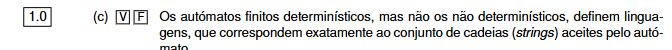

“Definir uma linguagem” aqui quer dizer:

> **O autómato determina exatamente quais palavras pertencem à linguagem e quais não pertencem.**

Ou seja, a **linguagem de um autómato** é simplesmente:

> **o conjunto de todas as palavras que esse autómato aceita.**


# O QUE É UMA LINGUAGEM

Suponha que o alfabeto é:

```text
Σ = {0,1}
```

Com estes símbolos podemos formar palavras como:

```text
0
1
00
01
10
11
001
101
1110
...
```

Uma linguagem é apenas **um conjunto escolhido dessas palavras**.

Por exemplo, podemos definir a linguagem:

> “Todas as palavras que terminam em 1.”

Então pertencem à linguagem:

```text
1
01
11
001
101
111
```

Mas não pertencem:

```text
0
10
100
110
```


Mas os dois continuam a **definir linguagens**, porque nos dois casos conseguimos dizer para cada palavra:

```text
aceite ✅
ou
rejeitada ❌
```

> **A linguagem reconhecida por um autómato é o conjunto de todas as palavras que, começando no estado inicial e depois de serem totalmente processadas, permitem terminar num estado final.**


---


> **AFD e AFN têm o mesmo poder de reconhecimento.**

Ou seja, reconhecem exatamente a mesma classe de linguagens: as **linguagens regulares**.

Portanto:

```text
AFD -> define uma linguagem regular ✅
AFN -> define uma linguagem regular ✅
```


---

> “Mas Os autómatos determinísticos (AFD) definem linguagens, mas os não determinísticos (AFN) não.”

**ERRADO**

Tanto um **AFD** como um **AFN** definem uma linguagem. Em ambos os casos, a linguagem do autómato é:

> o conjunto de todas as palavras/strings que o autómato aceita.

A diferença entre eles não está em “definir ou não uma linguagem”, mas em **como fazem as transições**.
