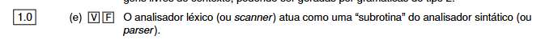

Sim. A correspondência principal é esta:

```text
Análise léxica      = scanner ou lexer
Análise sintática   = parser
Análise semântica   = semantic analyzer
```

Agora vamos separar bem cada uma.

# ANÁLISE LÉXICA — SCANNER / LEXER

O scanner lê os caracteres do programa e transforma-os em tokens.

Exemplo:

```text
x = 25;
```

O scanner lê os lexemas:

```text
x
=
25
;
```

e devolve tokens:

```text
IDENTIFICADOR
ATRIBUIÇÃO
NÚMERO
PONTO_E_VÍRGULA
```

Portanto:

> scanner/lexer = programa responsável pela análise léxica.

---

# ANÁLISE SINTÁTICA — PARSER

O parser recebe esses tokens e verifica se estão organizados segundo a gramática.

Por exemplo, se existe a regra:

```text
ATRIBUIÇÃO -> IDENTIFICADOR ATRIBUIÇÃO NÚMERO PONTO_E_VÍRGULA
```

e recebe:

```text
IDENTIFICADOR ATRIBUIÇÃO NÚMERO PONTO_E_VÍRGULA
```

está sintaticamente correto.

Portanto:

> parser = programa responsável pela análise sintática.

---

# ANÁLISE SEMÂNTICA — SEMANTIC ANALYZER

Depois de a estrutura estar sintaticamente correta, a análise semântica verifica se **faz sentido segundo as regras da linguagem**.

Por exemplo:

```text
int x;
x = 25;
```

é semanticamente aceitável:

```text
x é inteiro
25 é inteiro
```

Mas:

```text
int x;
x = "ola";
```

pode estar sintaticamente correto, mas semanticamente errado:

```text
x é inteiro
"ola" é texto

inteiro = texto ❌
```

Também verifica coisas como:

```text
x = 25;
```

quando `x` nunca foi declarado.

Nesse caso:

```text
sintaxe ✅
semântica ❌
```

O nome normal é simplesmente:

> **semantic analyzer**, ou analisador semântico.

Não há um nome tão universal como `scanner` e `parser`.

---

# O QUE É UMA SUBROTINA?

Uma **subrotina** é simplesmente:

> uma parte de um programa que outro código chama para executar uma tarefa específica e depois devolver o resultado.

É muito parecido com uma função.

Por exemplo:

```text
somar(3, 5)
```

O programa principal chama `somar`.

A função faz:

```text
3 + 5
```

e devolve:

```text
8
```

Então `somar` está a funcionar como uma subrotina.

---

# PORQUE DIZ QUE O SCANNER É UMA “SUBROTINA” DO PARSER?

Porque, numa implementação típica, o parser está a analisar a frase e vai pedindo ao scanner:

> “Dá-me o próximo token.”

Imagina:

```text
x = 25;
```

O parser pede:

```text
parser -> scanner:
"qual é o próximo token?"
```

Scanner lê `x` e responde:

```text
IDENTIFICADOR
```

O parser continua e volta a pedir:

```text
"próximo token?"
```

Scanner lê `=`:

```text
ATRIBUIÇÃO
```

Depois:

```text
NÚMERO
```

e depois:

```text
PONTO_E_VÍRGULA
```

Portanto podes imaginar:

```text
                  chama
PARSER --------------------------> SCANNER
  |                                  |
  |                                  | lê caracteres
  |                                  |
  | <--------------------------      |
  |        devolve TOKEN              |
  |
  | continua análise sintática
```

É neste sentido que a afirmação chama ao scanner uma **subrotina do parser**: o parser pode chamar o scanner sempre que precisa do próximo token.

A sequência geral fica:

```text
código fonte
    ↓
SCANNER / LEXER
análise léxica
    ↓
tokens
    ↓
PARSER
análise sintática
    ↓
estrutura / árvore
    ↓
SEMANTIC ANALYZER
análise semântica
```

Portanto, para decorar:

> **Scanner: “Que tokens tenho?”**
> **Parser: “Os tokens estão na ordem/estrutura correta?”**
> **Analisador semântico: “Essa estrutura faz sentido?”**

E **subrotina** = uma função/parte do programa que é chamada por outra parte para executar uma tarefa específica.


Sim. **Está correta: V (Verdadeiro).**

E desta vez o próprio PDF diz isso literalmente:

> “O analisador léxico (scanner) actua como uma ‘subrotina’ do analisador sintáctico (parser).” 

Portanto, no teste:

**Resposta: V ✅**

A ideia é:

```text
PARSER
  |
  | pede o próximo token
  v
SCANNER
  |
  | lê o programa fonte
  | reconhece o token
  v
devolve o token ao PARSER
```

Por exemplo, com:

```text
x = 25;
```

o parser pode ir pedindo ao scanner:

```text
"próximo token?"
```

e o scanner devolve sucessivamente:

```text
IDENTIFICADOR
ATRIBUIÇÃO
NÚMERO
PONTO_E_VÍRGULA
```

O PDF também diz que a função principal da análise léxica é produzir os tokens que **serão usados pelo analisador sintático**. 

Portanto, aqui não há dúvida: **Verdadeiro.**
