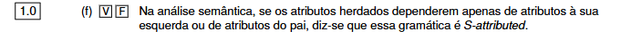

Certo. **A afirmação é Falsa.**

Ela diz:

> se os atributos herdados dependerem apenas de atributos à esquerda ou de atributos do pai, então a gramática é **S-attributed**.

Isso está errado porque essa é precisamente a condição de uma gramática **L-attributed**.

Guarda assim:

```text
S-attributed
= só há atributos sintetizados
= informação sobe dos filhos para o pai
```

```text
L-attributed
= pode haver atributos herdados
= esses atributos herdados só podem depender:
  - do pai
  - ou de símbolos à esquerda
```

Portanto, a frase correta seria:

> “...diz-se que essa gramática é **L-attributed**.”

✅ **Resposta: Falso**
