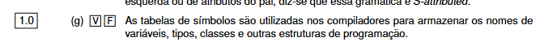

Sim. **Esta afirmação é Verdadeira (V)** e aparece praticamente com as mesmas palavras no teu PDF: as tabelas de símbolos são usadas pelos compiladores para armazenar nomes de variáveis, tipos, classes e outras estruturas, juntamente com informação sobre esses elementos. 


Uma **tabela de símbolos** é uma estrutura interna do compilador onde ele guarda informação sobre os nomes que aparecem no programa.

Pensa nela como uma ficha de registo.

Exemplo de código:

```text
int idade;
float salario;

idade = 25;
```

O compilador pode guardar algo deste género:

| Nome      | O que é  | Tipo    | Âmbito        | Endereço           | Outras informações      |
| --------- | -------- | ------- | ------------- | ------------------ | ----------------------- |
| `idade`   | variável | `int`   | função `main` | posição de memória | nº de referências, etc. |
| `salario` | variável | `float` | função `main` | posição de memória | nº de referências, etc. |

O mais importante é perceber o que pode estar lá dentro.

A tabela de símbolos pode guardar:

```text
nome
tipo
o que representa
scope/âmbito
endereço/localização
número de referências
outras propriedades associadas
```

Por exemplo:

```text
idade
```

pode ter:

```text
Nome: idade
Categoria: variável
Tipo: int
Scope: main
Endereço: posição X
```

Se for uma função:

```text
calcularTotal
```

pode ter:

```text
Nome: calcularTotal
Categoria: função
Tipo devolvido: float
Parâmetros: int, float
Scope: global
```

Se for uma classe:

```text
Aluno
```

pode guardar informação de que `Aluno` é uma classe e outras propriedades associadas.

## Para que serve?

Imagina:

```text
int x;
x = 25;
```

Quando o compilador chega a:

```text
x = 25;
```

consulta a tabela e vê:

```text
x -> int
```

Como `25` também é inteiro:

```text
int = int
```

✅ Está correto.

Agora:

```text
int x;
x = "ola";
```

A tabela diz:

```text
x -> int
```

mas `"ola"` é texto.

Logo:

```text
int = texto
```

❌ Erro semântico.

Também serve para saber se uma variável foi declarada.

Por exemplo:

```text
total = 50;
```

Se `total` não existir na tabela de símbolos, o compilador pode concluir:

```text
total não foi declarado
```

❌ Erro.

## E o scope?

`scope` ou **âmbito** significa:

> em que zona do programa aquele identificador pode ser usado.

Exemplo:

```text
int x;

void funcao() {
    int y;
}
```

A tabela pode saber:

```text
x -> scope global
y -> scope da função
```

Assim, fora da função, tentar usar `y` pode dar erro.

Portanto, a tabela de símbolos também ajuda a responder:

```text
Esta variável existe?
Que tipo tem?
É variável, função, classe, tipo...?
Em que scope está?
Pode ser usada aqui?
Onde está armazenada?
Quantas vezes é referenciada?
```

## Em que fases do compilador é usada?

Não pertence só a uma fase.

Pode começar a ser preenchida quando o analisador léxico encontra identificadores.

Por exemplo, encontra:

```text
contador
```

e reconhece:

```text
IDENTIFICADOR
```

Pode criar uma entrada para `contador`.

Mais tarde, ao encontrar:

```text
int contador;
```

fica a saber mais:

```text
contador.tipo = int
```

A análise semântica usa muito a tabela para verificar tipos, declarações e scope.

E fases posteriores do compilador também podem usar informação como:

```text
endereço
localização
tipo
```

Por isso, naquela pergunta:

```text
a) estrutura que guarda informação sobre símbolos ✅
b) usada nas fases de análise e síntese ✅
c) reflete o scope dos identificadores ✅
```

Logo:

```text
d) Todas as anteriores ✅
```

A frase mais simples para decorar é:

> **Tabela de símbolos = memória do compilador sobre os identificadores do programa e as informações associadas a eles.**
