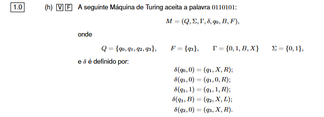

Sim. Antes de responder ao V/F, convém perceber a notação toda.

Na imagem tens:

```text
M = (Q, Σ, Γ, δ, q0, B, F)
```

Isto é a definição formal de uma **Máquina de Turing**.

# O QUE É UMA MÁQUINA DE TURING?

Uma Máquina de Turing é um modelo teórico de computador.

Tem essencialmente:

```text
1. Uma fita com células
2. Uma cabeça que lê/escreve numa célula
3. Um estado atual
4. Regras que dizem o que fazer
```

A fita pode imaginar-se assim:

```text
... B B 0 1 1 0 1 0 1 B B ...
        ^
      cabeça
```

A cabeça consegue:

* ler o símbolo onde está;
* substituir esse símbolo por outro;
* andar uma posição para a esquerda ou direita;
* mudar de estado.

Ao contrário de um autómato finito normal, a Máquina de Turing **pode alterar aquilo que está escrito na fita**.

---

# O QUE SIGNIFICA CADA SÍMBOLO

A tua máquina é:

```text
M = (Q, Σ, Γ, δ, q0, B, F)
```

Vamos um por um.

## Q — conjunto de estados

Na imagem:

```text
Q = {q0, q1, q2, q3}
```

São os estados possíveis da máquina.

Por exemplo:

```text
q0 = estado inicial
q1 = outro estado
q2 = outro estado
q3 = estado final
```

---

# Σ — SIGMA: alfabeto de entrada

Tens:

```text
Σ = {0,1}
```

Isto significa que as palavras dadas à máquina só são formadas por:

```text
0
1
```

Por exemplo:

```text
0110101
```

é uma palavra válida sobre esse alfabeto.

Atenção:

> `Σ` é **sigma**, não é épsilon.

---

# Γ — GAMA: alfabeto da fita

Tens:

```text
Γ = {0,1,B,X}
```

Isto inclui todos os símbolos que podem aparecer na fita durante o funcionamento.

Temos:

```text
0 e 1 = símbolos da palavra

B = célula vazia da fita

X = símbolo auxiliar que a máquina pode escrever
```

Repara que:

```text
Σ = {0,1}
```

mas:

```text
Γ = {0,1,B,X}
```

Porque `B` e `X` não fazem parte da palavra original, mas a máquina pode utilizá-los enquanto trabalha.

---

# B — BLANK, ou espaço vazio

`B` significa uma célula vazia da fita.

Se a palavra for:

```text
0110101
```

na realidade a fita pode ser imaginada assim:

```text
B B 0 1 1 0 1 0 1 B B B ...
```

Há espaços vazios antes e depois da palavra.

---

# q0 — estado inicial

A máquina começa no estado:

```text
q0
```

e normalmente com a cabeça sobre o primeiro símbolo da palavra:

```text
0 1 1 0 1 0 1
^
q0
```

---

# F — conjunto dos estados finais

Na imagem:

```text
F = {q3}
```

Isto quer dizer:

> `q3` é o estado de aceitação.

Se a máquina conseguir chegar a `q3` de acordo com as regras, a palavra é aceite.

---

# δ — DELTA: função de transição

Este símbolo:

```text
δ
```

chama-se **delta**.


A função `δ` contém as regras da Máquina de Turing.

Uma regra tem esta forma:

```text
δ(estado atual, símbolo lido)
=
(novo estado, símbolo a escrever, movimento)
```

Por exemplo, na tua máquina:

```text
δ(q0,0) = (q1,X,R)
```

Vamos traduzir literalmente.

Se:

```text
estado atual = q0
símbolo que estou a ler = 0
```

então:

```text
mudo para q1
escrevo X no lugar do 0
ando para a direita
```

---

# R e L

São os movimentos da cabeça:

```text
R = Right = direita
L = Left  = esquerda
```

Por exemplo:

```text
δ(q0,0) = (q1,X,R)
```

faz:

```text
ANTES:

0 1 1 0 ...
^
q0
```

escreve `X`:

```text
X 1 1 0 ...
```

e anda uma posição para a direita:

```text
X 1 1 0 ...
  ^
  q1
```

---

# AGORA AS REGRAS DA TUA MÁQUINA

Tens:

```text
δ(q0,0) = (q1,X,R)
```

Significa:

> Em `q0`, se encontrar `0`, substitui por `X`, passa para `q1` e anda para a direita.

---

Depois:

```text
δ(q1,0) = (q1,0,R)
```

Significa:

> Em `q1`, se encontrar `0`, deixa o `0` como está e continua para a direita.

E:

```text
δ(q1,1) = (q1,1,R)
```

Significa:

> Em `q1`, se encontrar `1`, deixa o `1` como está e continua para a direita.

Portanto `q1` serve essencialmente para:

> percorrer toda a palavra para a direita.

---

Depois:

```text
δ(q1,B) = (q2,X,L)
```

Quando chega ao primeiro espaço vazio `B` depois da palavra:

```text
... 0 1 B
        ^
```

a máquina:

```text
escreve X
passa para q2
anda uma posição para a esquerda
```

---

Finalmente:

```text
δ(q2,0) = (q3,X,R)
```

Isto significa:

> Estando em `q2`, se encontrar `0`, substitui-o por `X`, passa para `q3` e anda para a direita.

Como:

```text
q3 ∈ F
```

isto aceita a palavra.

---

# AGORA TESTAMOS 0110101

Palavra:

```text
0110101
```

Começamos:

```text
0 1 1 0 1 0 1 B
^
q0
```

A primeira regra é:

```text
δ(q0,0) = (q1,X,R)
```

Portanto:

```text
X 1 1 0 1 0 1 B
  ^
  q1
```

Agora `q1` vai andando para a direita.

Lê `1`:

```text
δ(q1,1) = (q1,1,R)
```

Continua.

Outro `1`, continua.

`0`, continua.

`1`, continua.

`0`, continua.

`1`, continua.

Até chegar:

```text
X 1 1 0 1 0 1 B
              ^
              q1
```

Agora usa:

```text
δ(q1,B) = (q2,X,L)
```

Escreve `X` no lugar do `B` e anda para a esquerda:

```text
X 1 1 0 1 0 1 X
            ^
            q2
```

E aqui está o problema.

A máquina está em:

```text
q2
```

e está a ler:

```text
1
```

Mas nas regras fornecidas só existe:

```text
δ(q2,0) = (q3,X,R)
```

Não existe:

```text
δ(q2,1) = ...
```

Portanto a máquina **não sabe o que fazer**.

Pára sem chegar ao estado final `q3`.

Logo:

```text
0110101 -> REJEITADA ❌
```

# RESPOSTA À QUESTÃO

A afirmação:

> “A seguinte Máquina de Turing aceita a palavra 0110101”

é:

**FALSA ❌**

O motivo é muito concreto:

```text
depois de percorrer a palavra,
a máquina volta uma posição para a esquerda
em q2.

O último símbolo de 0110101 é 1.

Mas não existe transição para:

δ(q2,1)

Logo não consegue chegar a q3.
```

Se a palavra acabasse em `0`, aí poderia aplicar:

```text
δ(q2,0) = (q3,X,R)
```

e chegaria ao estado final.


# Mas um exemplo em que seria aceite

Sim. O exemplo mais simples de uma palavra aceite por essa Máquina de Turing é:

```text
00
```

Vamos seguir passo a passo.

A máquina tem estas regras relevantes:

```text
δ(q0,0) = (q1,X,R)
δ(q1,0) = (q1,0,R)
δ(q1,B) = (q2,X,L)
δ(q2,0) = (q3,X,R)
```

e:

```text
F = {q3}
```

Logo, `q3` é o estado final.

# 1. Estado inicial

A fita começa assim:

```text
0 0 B
^
q0
```

A cabeça está no primeiro `0`.

Aplicamos:

```text
δ(q0,0) = (q1,X,R)
```

Isto significa:

* troca o `0` por `X`;
* passa para `q1`;
* anda para a direita.

Fica:

```text
X 0 B
  ^
  q1
```

# 2. Em q1 encontra 0

Temos:

```text
δ(q1,0) = (q1,0,R)
```

Portanto deixa o `0` igual e anda para a direita:

```text
X 0 B
    ^
    q1
```

# 3. Em q1 encontra B

Agora lê o espaço vazio `B`.

Temos:

```text
δ(q1,B) = (q2,X,L)
```

Então:

* substitui `B` por `X`;
* passa para `q2`;
* anda uma posição para a esquerda.

Fica:

```text
X 0 X
  ^
  q2
```

# 4. Em q2 encontra 0

Agora temos:

```text
δ(q2,0) = (q3,X,R)
```

Então:

* troca o `0` por `X`;
* passa para `q3`;
* anda para a direita.

Fica:

```text
X X X
    ^
    q3
```

E como:

```text
q3 ∈ F
```

a palavra é aceite.

Portanto:

```text
00 -> ACEITE ✅
```

A sequência dos estados foi:

```text
q0 -> q1 -> q1 -> q2 -> q3
```

E já dá para perceber uma característica desta máquina: ela precisa de começar por `0` e, quando chega ao fim, o último símbolo também tem de ser `0`. Por exemplo, `010`, `0110` e `000` também seriam aceites.


# Mas mesmo que a máquina não tenha lido todos os símbolos da entrada e entra num estado final de aceitação, a palavra é aceite? 

Sim. Numa máquina de Turing, **se ela entra num estado final de aceitação, a palavra é aceite mesmo que não tenha lido todos os símbolos da entrada**.

O importante é o estado em que a máquina termina, não ter obrigatoriamente percorrido toda a palavra.

Exemplo:

```text
Entrada: 01101

q0 lê 0 → q1
q1 lê 1 → qF
```

Se `qF` é estado final, então:

```text
01101 ✅ aceite
```

mesmo que ainda existam símbolos `101` por ler.

Só seria obrigatório percorrer toda a palavra se **a própria máquina tivesse sido construída com essa condição** antes de chegar ao estado final.
