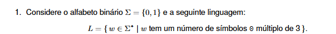
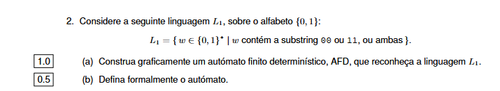
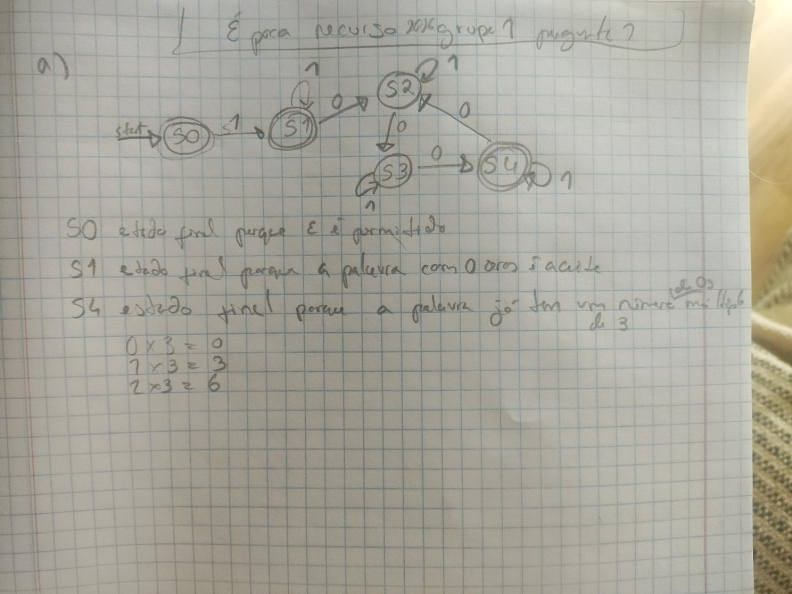
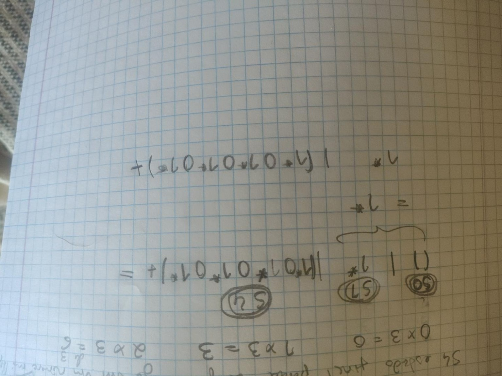

# Traduzir uma linguagem



> **Considere o alfabeto binário formado pelos símbolos 0 e 1. A linguagem L é o conjunto de todas as palavras feitas com 0 e 1 que têm uma quantidade de zeros múltipla de 3.**

Agora símbolo a símbolo:

```text
Σ = {0,1}
```

Significa:

> O alfabeto contém apenas `0` e `1`.

```text
w ∈ Σ*
```

Significa:

> `w` é uma palavra qualquer formada com `0` e `1`.

O `*` em `Σ*` significa que podem existir palavras de qualquer comprimento, incluindo a palavra vazia `ε`.


# MAS ATENÇÃO

NESTE EXEMPLO 

 O `*` em `{0,1}*` significa que **a palavra vazia ε pertence ao conjunto de todas as palavras possíveis sobre esse alfabeto**, mas isso não quer dizer que ε pertença automaticamente à linguagem `L1`.

O enunciado é:

```text
L1 = { w ∈ {0,1}* | w contém a substring 00 ou 11, ou ambas }
```

Lê-se assim:

> `L1` é o conjunto das palavras `w` formadas por 0 e 1, incluindo a possibilidade de `ε`, **mas só entram em L1 as que contêm `00` ou `11`**.

A parte:

```text
w ∈ {0,1}*
```

diz apenas de onde vêm as palavras candidatas.

A parte:

```text
w contém 00 ou 11
```

é o filtro.

Então:

```text
ε ∈ {0,1}*   ✅
```

mas:

```text
ε contém 00 ou 11?   ❌
```

Logo:

```text
ε ∉ L1
```

Por isso, o estado inicial **não pode ser final**.

Pensa assim:

```text
{0,1}*
=
ε, 0, 1, 00, 01, 10, 11, 000, 001, ...
```

Mas `L1` seleciona apenas algumas dessas palavras:

```text
00    ✅
11    ✅
001   ✅
110   ✅
1001  ✅ contém 00
0110  ✅ contém 11
```

e rejeita:

```text
ε     ❌
0     ❌
1     ❌
01    ❌
10    ❌
0101  ❌
1010  ❌
```


# O que signiica ser múltiplo de 3, e ter 0 zeros ja significa que é múltiplo?

Porque o enunciado não diz que a palavra tem de ter “um grupo visível de 3 zeros”. Diz que o **número de símbolos `0` tem de ser múltiplo de 3**.

Na palavra:

```text
1111
```

há:

```text
0 símbolos 0
```

E 0 é múltiplo de 3, porque:

```text
0 = 3 × 0
```

Tal como:

```text
3 = 3 × 1
6 = 3 × 2
9 = 3 × 3
```

Portanto os números de zeros permitidos são:

```text
0, 3, 6, 9, 12, ...
```

Logo:

```text
1111
```

tem 0 zeros, e **0 é múltiplo de 3**, por isso a palavra é aceite.

A regra para decorar é:

> **0 é múltiplo de qualquer número inteiro não nulo**, porque `0 = n × 0`.

# E para ser divisor de 3

> “o número de zeros é divisor de 3”

Se o número de zeros fosse 0, teríamos de conseguir:

```text
3 = 0 × k
```

Mas qualquer número multiplicado por 0 dá:

```text
0 × k = 0
```

Nunca dá 3.

Logo:

> 0 não é divisor de 3. ❌

Os divisores positivos de 3 são:

```text
1 e 3
```


# Eu vou desenhar no caderno uma resolução



