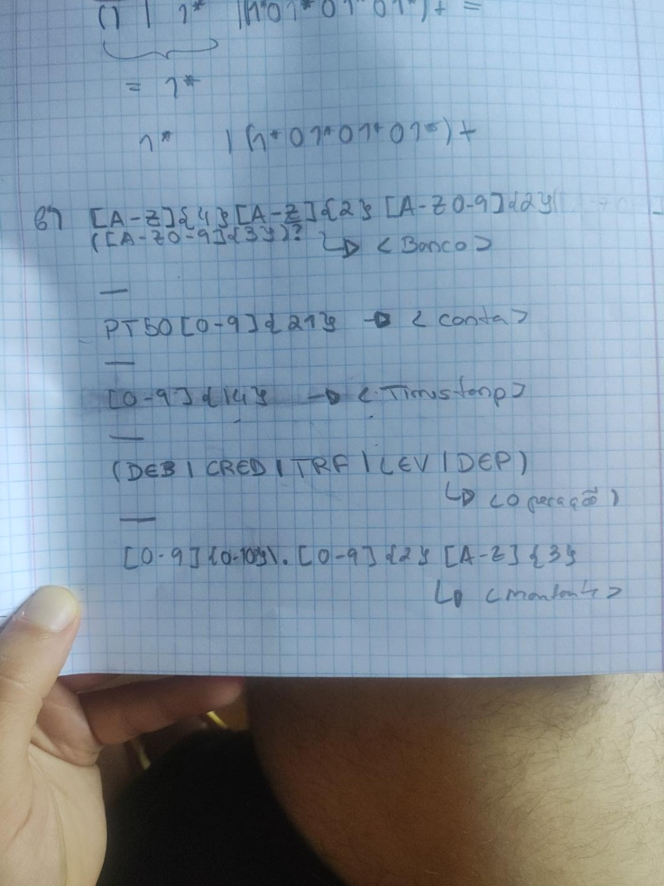

# Letras maiúsculas vs Caracteres alfanuméricos maiúsculos

Não, não é a mesma coisa.

**Letras maiúsculas** significa apenas letras de `A` a `Z`.

Exemplos:

```text
A
B
X
Z
```

Já **caracteres alfanuméricos maiúsculos** normalmente significa:

> letras maiúsculas + algarismos

Ou seja:

```text
A-Z
0-9
```

Exemplos:

```text
A
B
Z
0
5
9
```

Portanto:

```text
Letras maiúsculas:
[A-Z]
```

```text
Caracteres alfanuméricos maiúsculos:
[A-Z0-9]
```

O termo **alfanumérico** vem de:

```text
alfa = letras
numérico = números
```

Por isso, `ABC` tem só letras maiúsculas, enquanto `AB12C` tem caracteres alfanuméricos maiúsculos.


# Resposta 

