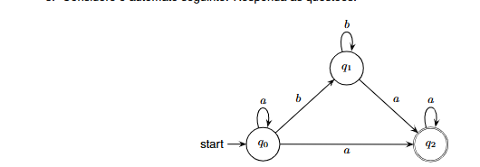
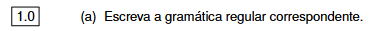
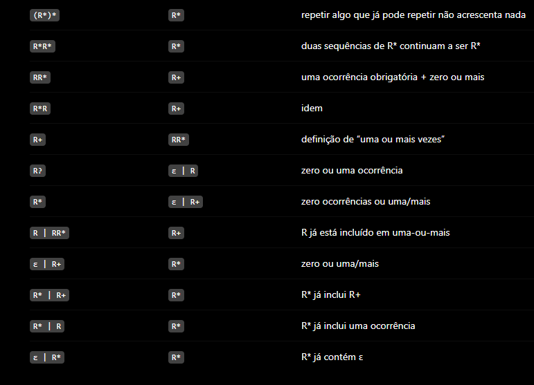

# Os self loops dos estados são lidos como opcionais

No `q0`, com o símbolo `a`, existem **duas transições possíveis**:

```text
q0 --a--> q0
q0 --a--> q2
```

### Caminho 1: ir diretamente de q0 para q2

Antes de sair de `q0`, podemos fazer o loop `a` zero ou mais vezes:

```text
Autómato: q0 --a--> q2 
=> 
Expressão Regular: a*
```

Depois precisamos de um `a` para ir:

```text
q0 --a--> q2
=> 
Expressão Regular: a
```

E em `q2` podemos continuar a ler `a`:

```text
q2 --a--> q2
=> 
Expressão Regular: a*
```

Portanto:

```text
a* a a*
```

que equivale simplesmente a:

```text
a+
```

Ou seja:

```text
a
aa
aaa
aaaa
...
```

são aceites.


# Minimizar/simplificar expressões regulares




