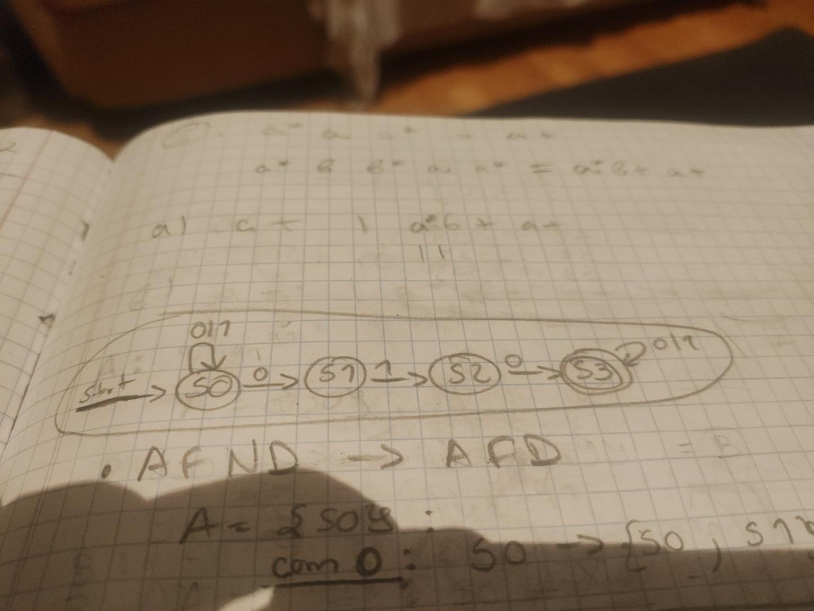
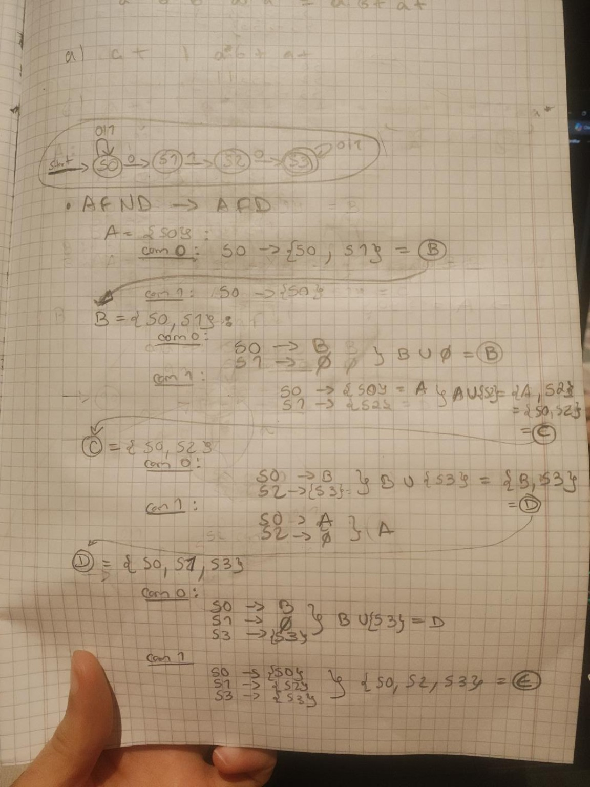
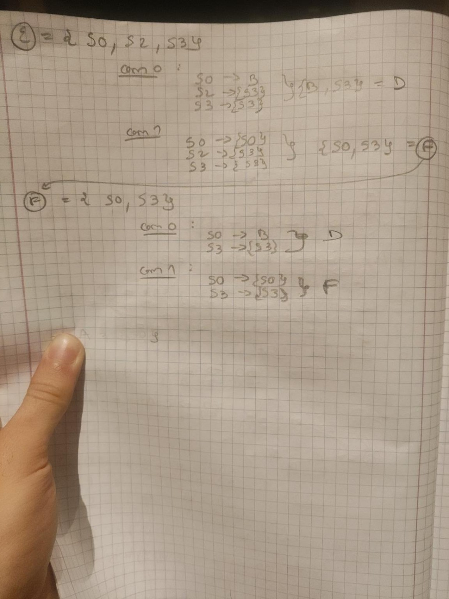
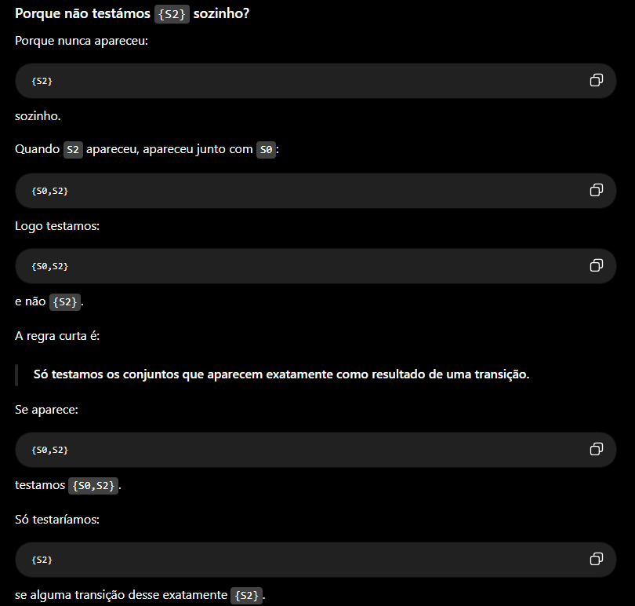
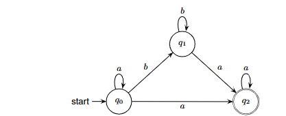
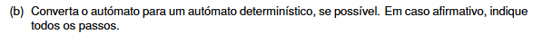

# (NÃO É NECESSÁRIO PARA ESTE EXERCÍCIO) CONVERTER AFND -> AFD

A conversão de **AFND/AFN para AFD** faz-se por uma regra central:


**TOME ESTE EXEMPLO**

O teu AFND é:

```text
S0 --0--> S0
S0 --0--> S1
S0 --1--> S0

S1 --1--> S2

S2 --0--> S3

S3 --0--> S3
S3 --1--> S3
```

Estado inicial:

```text
S0
```

Estado final:

```text
S3
```

## 1. Começamos pelo estado inicial

No AFD:

```text
A = {S0}
```

Agora vemos os destinos com `0` e `1`.

Com `0`, a partir de `S0`:

```text
S0 --0--> S0
S0 --0--> S1
```






# IMPORTANTE



# Lembrando que, numa conversão de AFND para AFD, a ordem não interessa, ou seja, 
F = {S0,S3} = {S3,S0} 


## AFD final

| Estado            | `0` | `1` | Final? |
| ----------------- | --- | --- | ------ |
| → A = `{S0}`      | B   | A   | Não    |
| B = `{S0,S1}`     | B   | C   | Não    |
| C = `{S0,S2}`     | D   | A   | Não    |
| *D = `{S0,S1,S3}` | D   | E   | Sim    |
| *E = `{S0,S2,S3}` | D   | F   | Sim    |
| *F = `{S0,S3}`    | D   | F   | Sim    |

Portanto, os estados finais do AFD são:

```text
D = {S0,S1,S3}
E = {S0,S2,S3}
F = {S0,S3}
```

porque todos contêm o estado final original:

```text
S3
```

Fica assim o **AFD final**, usando os nomes que demos aos estados-conjunto:

```text
A = {S0}
B = {S0,S1}
C = {S0,S2}
D = {S0,S1,S3}   FINAL
E = {S0,S2,S3}   FINAL
F = {S0,S3}      FINAL
```

As transições são:

```text
A --0--> B
A --1--> A

B --0--> B
B --1--> C

C --0--> D
C --1--> A

D --0--> D
D --1--> E

E --0--> D
E --1--> F

F --0--> D
F --1--> F
```

A tabela final, que é a forma mais fácil de desenhar no exame, é:

| Estado | `0` | `1` |
| ------ | --- | --- |
| → A    | B   | A   |
| B      | B   | C   |
| C      | D   | A   |
| *D     | D   | E   |
| *E     | D   | F   |
| *F     | D   | F   |

`→` = inicial
`*` = final

Portanto, começas em **A** e os estados finais são **D, E e F**.


# AGORA VAMOS RESOLVER O EXERCICIO





# QUALQUER AUTOMATO FINITO COM O ALFABETO {0,1}, SEJA DETERMINISTICO OU NÃO, PODE SER CONVERTIDO PARA UMA GRAMATICA REGULAR

Para converter um autómato finito numa **gramática regular (tipo 3)**, não é obrigatório que o autómato seja determinístico. A construção funciona também diretamente para um **AFND**.
